# Stack d'observabilité

### Reverse proxy · Monitoring · Logs · Tracing — sur un seul hôte Docker

[English](README.md) · **Français**

Ce dépôt fait tourner une plateforme d'observabilité complète et auto-hébergée avec Docker Compose. Elle remplit deux rôles :

1. **C'est la porte d'entrée du serveur.** Traefik reçoit tout le trafic HTTP et HTTPS, obtient les certificats TLS automatiquement et envoie chaque domaine vers le bon conteneur.
2. **Elle montre ce qui se passe à l'intérieur.** Elle collecte les trois signaux de l'observabilité (**métriques**, **logs** et **traces**), les stocke, déclenche des alertes et permet de passer d'un signal à l'autre dans Grafana.

Ajouter une application ne demande aucune modification de cette stack : l'application déclare quelques labels Docker et variables d'environnement, et tout le reste est automatique.

| Pilier | Composants | Répond à la question |
|---|---|---|
| Reverse proxy / TLS | Traefik v3, Let's Encrypt, proxy du socket Docker | *Comment le trafic atteint-il mes services, en sécurité ?* |
| Monitoring | Prometheus, Alertmanager, node-exporter, cAdvisor, Grafana | *Tout va-t-il bien en ce moment ? Qui est prévenu sinon ?* |
| Logs | Grafana Alloy, Loki | *Qu'a dit exactement l'application ?* |
| Tracing | OpenTelemetry, Grafana Alloy, Tempo | *Où cette requête a-t-elle passé son temps, et où a-t-elle échoué ?* |

---

## Sommaire

**Comprendre**
1. [Notions clés](#1-notions-clés)
2. [Vue d'ensemble de l'architecture](#2-vue-densemble-de-larchitecture)
3. [Composants](#3-composants)
4. [Réseaux et modèle de sécurité](#4-réseaux-et-modèle-de-sécurité)

**Fonctionnement de chaque pilier**

5. [Reverse proxy et TLS](#5-reverse-proxy-et-tls)
6. [Monitoring et alertes](#6-monitoring-et-alertes)
7. [Logs](#7-logs)
8. [Tracing](#8-tracing)
9. [Corrélation des signaux](#9-corrélation-des-signaux)
10. [Les fichiers de configuration](#10-les-fichiers-de-configuration)

**Utiliser**

11. [Installation](#11-installation)
12. [Intégrer une application](#12-intégrer-une-application)
13. [Liste de vérification](#13-liste-de-vérification)

**Exploiter**

14. [Exploitation](#14-exploitation)
15. [Renforcer la sécurité](#15-renforcer-la-sécurité)
16. [Dépannage](#16-dépannage)
17. [Référence](#17-référence)
18. [Choix de conception](#18-choix-de-conception)
19. [Glossaire](#19-glossaire)

---

## 1. Notions clés

Si vous connaissez déjà Prometheus, Loki et OpenTelemetry, passez à la [section 2](#2-vue-densemble-de-larchitecture).

### Les trois signaux

| Signal | Ce que c'est | Exemple | Utile pour | Stocké dans |
|---|---|---|---|---|
| **Métrique** | Un nombre mesuré dans le temps, avec des labels | `traefik_service_requests_total{service="api", code="500"} = 42` | Tendances, tableaux de bord, alertes. Peu coûteux à garder des semaines | Prometheus |
| **Log** | Une ligne de texte horodatée écrite par un programme | `{"level":"error","msg":"paiement refusé","trace_id":"4bf9…"}` | Le « pourquoi » détaillé d'un événement | Loki |
| **Trace** | Le parcours d'une requête à travers les services, composé de **spans** chronométrés | `GET /orders` 320 ms → `db.query` 280 ms | Décomposer la latence, trouver l'étape qui échoue | Tempo |

Les trois se complètent. Une **métrique** dit *qu'il y a un problème* (la latence monte). Une **trace** dit *où* (l'appel à la base de données). Les **logs** de cette trace disent *pourquoi* (un index manquant, un délai dépassé).

### Collecte (pull) et envoi (push)

- **Pull (scrape) :** Prometheus appelle `http://cible/metrics` toutes les 15 secondes. Utilisé pour l'infrastructure : Traefik, l'hôte, les conteneurs.
- **Push :** l'application envoie elle-même ses données. Utilisé pour les traces et les métriques applicatives, en **OTLP**.

### OpenTelemetry et OTLP

**OpenTelemetry** est le standard neutre pour produire de la télémétrie. Ses SDK existent pour tous les grands langages et savent instrumenter automatiquement les frameworks courants. **OTLP** est son protocole de transport, sur le port 4317 (gRPC) ou 4318 (HTTP). Une application instrumentée une fois avec OpenTelemetry peut envoyer vers n'importe quel backend compatible, sans changer son code.

### Labels et cardinalité

Les métriques et les flux de logs sont identifiés par des **labels** (`service="api"`, `level="error"`). Chaque combinaison unique de labels forme une série ou un flux distinct. La **cardinalité** est le nombre de ces combinaisons. Mettre dans un label une valeur qui change à chaque requête (un identifiant d'utilisateur, un identifiant de trace) crée des millions de séries et surcharge la base. C'est pour cela que cette stack garde `trace_id` **hors** des labels de Loki et le range en *structured metadata* (voir [section 7](#7-logs)).

### Propagation du contexte

Quand Traefik transmet une requête, il ajoute un en-tête HTTP `traceparent` (standard W3C Trace Context) qui porte l'identifiant de trace. Chaque service instrumenté le lit et rattache ses propres spans à la même trace. C'est ainsi qu'une seule trace couvre le proxy, l'API et la base de données.

---

## 2. Vue d'ensemble de l'architecture

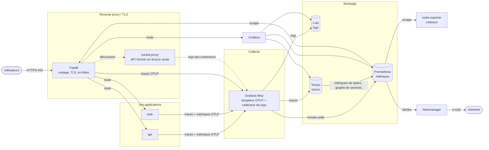

**Lecture du schéma, de gauche à droite :**

1. **Traefik** reçoit chaque requête venue d'Internet, termine le TLS, transmet la requête au bon conteneur et démarre une trace.
2. Les **applications** traitent la requête et envoient leurs spans et métriques en OTLP à **Alloy**.
3. **Alloy** lit aussi la sortie stdout/stderr de chaque conteneur via le proxy du socket.
4. Alloy envoie chaque signal à son stockage : logs vers **Loki**, traces vers **Tempo**, métriques vers **Prometheus**.
5. **Tempo** calcule débit, taux d'erreurs et durée à partir des spans et les écrit dans Prometheus.
6. **Prometheus** collecte aussi Traefik, l'hôte (node-exporter) et les conteneurs (cAdvisor), évalue les règles d'alerte et transmet les alertes déclenchées à **Alertmanager**, qui prévient la personne d'astreinte par e-mail.
7. **Grafana** interroge les trois stockages et les relie entre eux.

### Une requête, de bout en bout

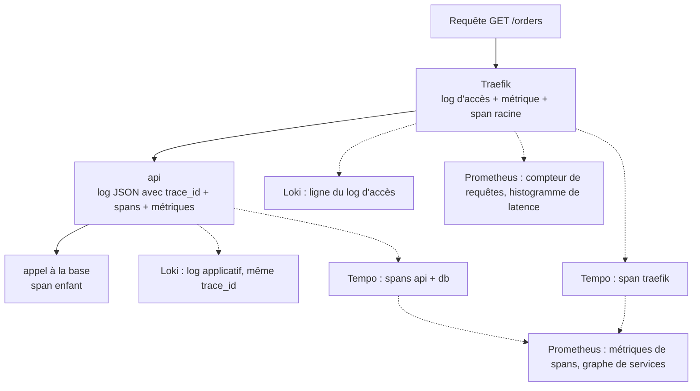

Une seule requête produit des données dans les trois stockages, et chaque élément porte le même identifiant de trace ou le même nom de service : c'est ce qui rend la corrélation possible.

---

## 3. Composants

| Service | Image et version | Rôle | Ports internes | URL publique |
|---|---|---|---|---|
| `traefik` | `traefik:v3.7.13` | Reverse proxy, terminaison TLS, logs d'accès, métriques de requêtes, spans racine | 80, 443, 8082 métriques, 8081 ping | `traefik.<DOMAIN>` (basic auth) |
| `socket-proxy` | `tecnativa/docker-socket-proxy:v0.5.0` | Filtre HTTP en lecture seule devant `docker.sock` | 2375 | — |
| `prometheus` | `prom/prometheus:v3.14.0` | Base de métriques, collecte, évaluation des règles d'alerte, réception remote write | 9090 | `prometheus.<DOMAIN>` (basic auth) |
| `alertmanager` | `prom/alertmanager:v0.34.1` | Dédoublonne, regroupe, met en sourdine et route les alertes, envoie les e-mails | 9093 | `alertmanager.<DOMAIN>` (basic auth) |
| `node-exporter` | `prom/node-exporter:v1.12.1` | Métriques de l'hôte : CPU, mémoire, disques, réseau, systèmes de fichiers | 9100 | — |
| `cadvisor` | `ghcr.io/google/cadvisor:0.60.5` | CPU, mémoire, bridage et réseau par conteneur | 8080 | — |
| `alloy` | `grafana/alloy:v1.19.2` | Agent de collecte : logs Docker, récepteur OTLP pour traces, métriques et logs | 4317 gRPC, 4318 HTTP, 12345 UI | — |
| `loki` | `grafana/loki:3.7.7` | Base de logs : index des labels + blocs compressés, rétention | 3100 | — |
| `tempo` | `grafana/tempo:3.0.3` | Base de traces, génération des métriques de spans et du graphe de services | 3200 API, 4317 OTLP | — |
| `grafana` | `grafana/grafana:13.2.2` | Tableaux de bord, exploration, corrélation entre signaux | 3000 | `grafana.<DOMAIN>` (connexion Grafana) |
| `volume-init` | `busybox:1.37` | Conteneur ponctuel : donne à Loki et Tempo la propriété de leurs volumes, puis s'arrête | — | — |

Toutes les versions sont figées dans `.env` et ont été vérifiées en septembre 2026.

---

## 4. Réseaux et modèle de sécurité

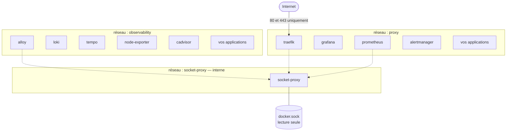

Un conteneur peut appartenir à plusieurs réseaux. Traefik, Prometheus et vos applications sont sur deux réseaux : c'est ce qui leur permet de relier les zones.

| Réseau | Membres | Rôle |
|---|---|---|
| `proxy` | Traefik et tous les services qu'il route | Transporte le trafic public de Traefik vers les services |
| `observability` | Backends de télémétrie et applications | Les applications envoient l'OTLP à Alloy. Prometheus collecte ses cibles |
| `socket-proxy` | socket-proxy, Traefik, Prometheus, Alloy | Accès à l'API Docker uniquement. Déclaré `internal` : aucune route vers Internet |

Les réseaux `proxy` et `observability` ont des **noms fixes** : les autres projets Compose peuvent les rejoindre comme réseaux `external`.

### Couches de sécurité

| Couche | Mesure |
|---|---|
| Exposition de l'hôte | Seuls les ports 80 et 443 sont publiés. Aucun port de base de données, d'exporter ou de backend n'est joignable de l'extérieur |
| Transport | HTTP est redirigé vers HTTPS. TLS 1.2 minimum, suites AEAD uniquement, SNI strict, HSTS avec preload |
| Interfaces d'administration | Dashboard Traefik, Prometheus et Alertmanager demandent un basic auth bcrypt. Grafana utilise ses propres comptes, avec l'inscription désactivée |
| Backends internes | Loki, Tempo et Alloy n'ont aucune route publique |
| API Docker | Seul le proxy du socket monte `docker.sock`, et il n'autorise que la lecture des conteneurs, réseaux, événements et de la version. Les `POST` sont refusés : impossible de créer, arrêter un conteneur ou d'y exécuter une commande à travers lui. cAdvisor monte aussi les dossiers Docker en lecture seule pour lire les statistiques des conteneurs |
| Secrets | Les mots de passe sont dans `.env` et `secrets/`, tous deux ignorés par Git. Alertmanager lit le mot de passe SMTP depuis un fichier, jamais dans sa configuration |
| Isolation des ressources | Chaque service a une limite mémoire : un composant qui s'emballe ne peut pas asphyxier l'hôte |

---

## 5. Reverse proxy et TLS

### 5.1 Vocabulaire

| Terme Traefik | Signification |
|---|---|
| **Entrypoint** | Un port sur lequel Traefik écoute (`web` = 80, `websecure` = 443) |
| **Router** | Une règle qui reconnaît des requêtes (par exemple `Host(\`api.example.com\`)`) et les envoie à un service |
| **Service** | Le backend qui reçoit les requêtes reconnues : IP et port du conteneur |
| **Middleware** | Une transformation appliquée entre le routeur et le service : en-têtes, authentification, compression, limitation |
| **Provider** | L'endroit où Traefik lit sa configuration de routage : labels Docker ou dossier de fichiers |
| **Certificate resolver** | Le mécanisme qui obtient les certificats, ici Let's Encrypt |

### 5.2 Cycle de vie d'une requête

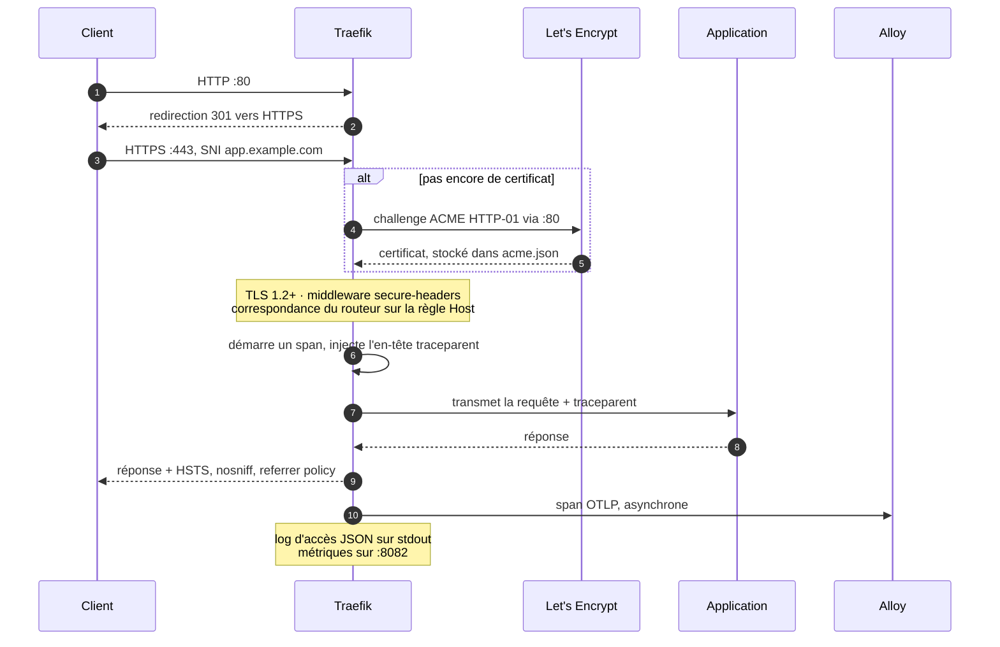

### 5.3 Deux sources de configuration

Traefik sépare la configuration **statique** (lue une fois au démarrage) de la configuration **dynamique** (rechargée en marche).

| Type | Où dans ce dépôt | Contient | Rechargement |
|---|---|---|---|
| Statique | Options `command:` du service `traefik` dans `compose.yml` | Entrypoints, resolver de certificats, providers, métriques, tracing, logs | Redémarrer Traefik |
| Dynamique, depuis Docker | Labels de chaque conteneur | Routeurs et services de vos applications | Automatique au démarrage ou à l'arrêt des conteneurs |
| Dynamique, depuis des fichiers | `traefik/dynamic/middlewares.yml` | Middlewares partagés et options TLS | Automatique quand le fichier change |

La configuration statique est écrite en options de ligne de commande, pas dans un fichier `traefik.yml`, pour deux raisons. Traefik n'accepte **qu'une seule** source statique à la fois : mélanger un fichier et des options ferait ignorer l'un des deux sans avertissement. Et les options peuvent utiliser `${DOMAIN}` et `${ACME_EMAIL}` directement depuis `.env`.

### 5.4 Entrypoints

| Entrypoint | Adresse | Rôle |
|---|---|---|
| `web` | `:80` | Répond au challenge HTTP-01 de Let's Encrypt, puis redirige tout le reste vers HTTPS en 301 |
| `websecure` | `:443` | Tout le trafic réel. Le resolver Let's Encrypt et le middleware `secure-headers` s'appliquent par défaut à chaque routeur |
| `metrics` | `:8082` | Métriques Prometheus. Non publié |
| `ping` | `:8081` | Utilisé par le healthcheck du conteneur. Non publié |

### 5.5 Obtention d'un certificat

1. Un conteneur avec une nouvelle règle `Host()` démarre. Traefik le voit via le proxy du socket.
2. Comme `websecure` utilise le resolver `letsencrypt`, Traefik demande un certificat pour ce domaine à Let's Encrypt.
3. Let's Encrypt appelle `http://<domaine>/.well-known/acme-challenge/…` sur le port 80. Traefik répond sur ce chemin avant d'appliquer la redirection HTTPS.
4. Le certificat est enregistré dans `acme.json`, dans le volume `letsencrypt`, et renouvelé automatiquement environ 30 jours avant expiration.
5. Prometheus surveille la date d'expiration : `TraefikCertificateExpiringSoon` se déclenche si un certificat expire dans moins de 14 jours, ce qui signifie que le renouvellement échoue.

**Conditions :** le domaine doit pointer vers le serveur et le port 80 doit être joignable depuis Internet.

### 5.6 Middlewares partagés

Définis dans `traefik/dynamic/middlewares.yml` et référencés depuis les labels avec le suffixe `@file`.

| Middleware | Appliqué | Ce qu'il fait |
|---|---|---|
| `secure-headers@file` | Automatiquement, sur chaque routeur HTTPS | `Strict-Transport-Security` 1 an + sous-domaines + preload, `X-Content-Type-Options: nosniff`, `X-Frame-Options: SAMEORIGIN`, `Referrer-Policy: strict-origin-when-cross-origin`, une `Permissions-Policy` restrictive, et suppression de `Server` et `X-Powered-By` |
| `admin-auth@file` | Dashboard Traefik, Prometheus, Alertmanager | Authentification basic contre `secrets/htpasswd` (bcrypt). L'en-tête `Authorization` est retiré avant d'atteindre le backend |
| `compress@file` | Sur demande (Grafana l'utilise) | Compression gzip / brotli des réponses |
| `rate-limit@file` | Sur demande | 100 requêtes par seconde en moyenne, pointes jusqu'à 200, par IP cliente |

### 5.7 Ajouter une route

```yaml
labels:
  traefik.enable: "true"
  traefik.http.routers.shop.rule: Host(`shop.example.com`)
  traefik.http.routers.shop.entrypoints: websecure
  traefik.http.services.shop.loadbalancer.server.port: "8080"
  # optionnel
  traefik.http.routers.shop.middlewares: compress@file,rate-limit@file
```

Le nom du routeur (`shop` ici) doit être unique sur l'hôte. Le conteneur doit être sur le réseau `proxy`.

---

## 6. Monitoring et alertes

### 6.1 D'où viennent les métriques

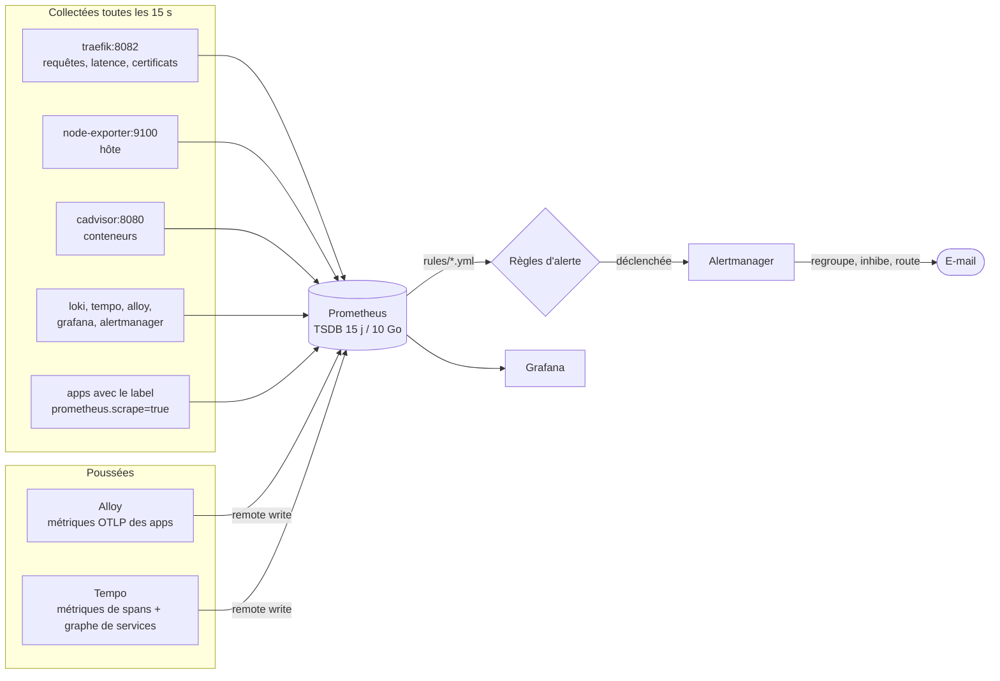

| Source | Collectée comment | Métriques principales |
|---|---|---|
| Traefik | Scrape de `traefik:8082` | `traefik_service_requests_total`, `traefik_service_request_duration_seconds`, `traefik_tls_certs_not_after` |
| Hôte | Scrape de node-exporter | `node_cpu_seconds_total`, `node_memory_MemAvailable_bytes`, `node_filesystem_avail_bytes` |
| Conteneurs | Scrape de cAdvisor | `container_memory_working_set_bytes`, `container_cpu_usage_seconds_total`, `container_cpu_cfs_throttled_periods_total` |
| La stack elle-même | Scrape de chaque composant | Santé de Prometheus, Loki, Tempo, Alloy, Grafana, Alertmanager |
| Applications, OTLP | Push vers Alloy, qui écrit dans Prometheus | Durée des requêtes HTTP, métriques du runtime, métriques personnalisées |
| Applications, `/metrics` | Scrape, découvert par labels | Ce que l'application expose |
| Tempo | Remote write | `traces_spanmetrics_*`, `traces_service_graph_*` |

### 6.2 Découverte automatique des applications

Le job `docker-apps` de `prometheus/prometheus.yml` demande à l'API Docker, via le proxy du socket, la liste des conteneurs toutes les 30 secondes, puis la filtre et la réécrit :

| Étape | Règle de relabel | Effet |
|---|---|---|
| 1 | Garder si le label `prometheus.scrape` vaut `true` | Les conteneurs sans ce label sont ignorés |
| 2 | Garder seulement l'adresse sur le réseau `observability` | Prometheus ne peut joindre que les conteneurs de ce réseau |
| 3 | `__address__` = IP réseau + label `prometheus.port` | Indique à Prometheus où se connecter |
| 4 | `__metrics_path__` = label `prometheus.path` (s'il existe) | Chemin par défaut : `/metrics` |
| 5 | Ajout des labels `container`, `service`, `project` | Permet de filtrer les métriques par service et projet Compose |

Ajouter une application collectée ne demande donc jamais de modifier `prometheus.yml`.

### 6.3 Cycle de vie d'une alerte

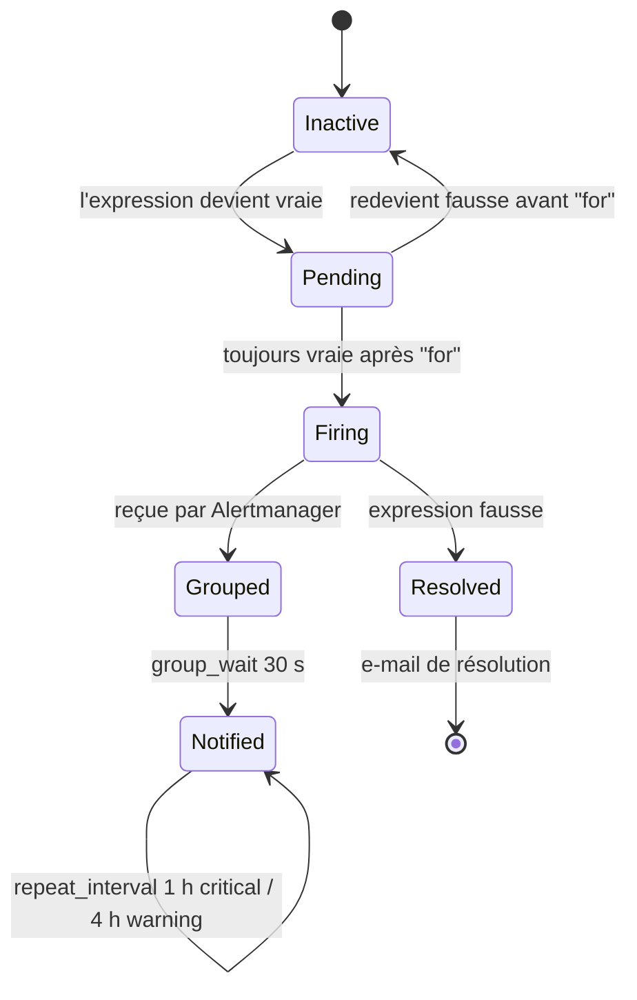

1. Prometheus évalue chaque règle toutes les 15 secondes.
2. Quand une expression devient vraie, l'alerte est **pending** (en attente). Elle passe **firing** (déclenchée) seulement si elle reste vraie pendant la durée `for` de la règle : cela évite d'alerter sur un pic bref.
3. Alertmanager **regroupe** les alertes de même `alertname` et `severity`, attend 30 secondes pour réunir les alertes liées, puis envoie un seul e-mail.
4. **Inhibition :** une alerte `critical` masque l'alerte `warning` de même nom sur la même instance, pour ne pas être prévenu deux fois du même problème.
5. Tant que le problème dure, l'e-mail est renvoyé toutes les heures pour `critical` et toutes les 4 heures pour `warning`. Les alertes `info` sont enregistrées mais jamais envoyées.
6. Quand l'expression redevient fausse, un e-mail de résolution est envoyé.

### 6.4 Règles d'alerte

| Fichier | Alerte | Condition | Gravité |
|---|---|---|---|
| `host.yml` | `HostDown` | node-exporter injoignable pendant 2 min | critical |
| | `HostHighCpuLoad` | CPU au-dessus de 85 % pendant 10 min | warning |
| | `HostOutOfMemory` | Moins de 10 % de mémoire disponible pendant 5 min | critical |
| | `HostDiskAlmostFull` | Moins de 10 % libres sur un système de fichiers inscriptible | critical |
| | `HostDiskWillFillIn24h` | La prédiction linéaire sur 6 h annonce un disque plein sous 24 h | warning |
| `containers.yml` | `ContainerMemoryNearLimit` | Au-dessus de 90 % de sa limite mémoire pendant 5 min | warning |
| | `ContainerCpuThrottled` | Plus de 25 % des périodes CPU bridées pendant 10 min | warning |
| | `ContainerDisappeared` | Conteneur non vu depuis 2 min | warning |
| `traefik.yml` | `TraefikHigh5xxRate` | Plus de 5 % de réponses 5xx pour un service | critical |
| | `TraefikHighLatencyP95` | Latence p95 au-dessus de 1 s pendant 10 min | warning |
| | `TraefikCertificateExpiringSoon` | Certificat expirant dans moins de 14 jours | warning |
| `stack.yml` | `TargetDown` | Une cible de collecte injoignable pendant 5 min | warning |
| | `PrometheusConfigReloadFailed` | Échec du dernier rechargement de configuration | warning |
| | `AlertmanagerNotificationsFailing` | Les e-mails ne peuvent pas être envoyés | critical |
| | `PrometheusStorageNearRetentionSize` | Stockage au-dessus de 90 % de la taille limite | info |

**Ajouter une règle :** créer ou modifier un fichier dans `prometheus/rules/`, le vérifier, puis recharger Prometheus :

```bash
docker compose exec prometheus sh -c 'promtool check rules /etc/prometheus/rules/*.yml'
docker compose exec prometheus wget -qO- --post-data='' http://localhost:9090/-/reload
```

### 6.5 Tableaux de bord

Grafana est livré avec ses datasources mais sans tableau de bord. Importez ces tableaux de bord communautaires (*Dashboards → New → Import*, puis choisir la datasource Prometheus) :

| ID | Tableau de bord | Affiche |
|---|---|---|
| `1860` | Node Exporter Full | CPU, mémoire, disque et réseau de l'hôte |
| `17346` | Traefik Official Standalone Dashboard | Requêtes, codes de statut et latence par service et entrypoint |

Pour versionner vos propres tableaux de bord, exportez-les en JSON dans `grafana/dashboards/`. Grafana relit ce dossier toutes les 30 secondes et les place dans le dossier *Observability*.

---

## 7. Logs

### 7.1 Chaîne de traitement

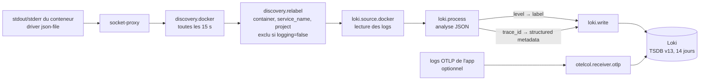

### 7.2 Le parcours d'une ligne de log

Prenons cette ligne écrite par le conteneur `api` :

```json
{"level":"error","time":1789646704759,"trace_id":"8285620e9b55759362ba3ef621f399b0","msg":"paiement refusé"}
```

| Étape | Composant Alloy | Résultat |
|---|---|---|
| 1. Découverte | `discovery.docker` | Alloy sait que le conteneur existe (il rafraîchit la liste toutes les 15 s) |
| 2. Labels | `discovery.relabel` | Labels du flux : `container="shop-api-1"`, `service_name="api"`, `project="shop"` |
| 3. Collecte | `loki.source.docker` | Alloy lit la nouvelle ligne via l'API Docker et mémorise sa position : rien n'est relu après un redémarrage |
| 4. Analyse | `stage.json` | Extrait `level` = `error` et `trace_id` = `8285…`. Accepte aussi `severity`, `lvl`, `traceId`, `TraceId` |
| 5. Label indexé | `stage.labels` | `level="error"` devient un label : il n'existe qu'une poignée de valeurs, l'indexer coûte peu |
| 6. Métadonnée | `stage.structured_metadata` | `trace_id` est attaché à la ligne sans être indexé |
| 7. Stockage | `loki.write` | Envoi à Loki, qui compresse les lignes en blocs et n'indexe que les labels |

Les lignes qui ne sont pas du JSON sautent les étapes 4 à 6 et sont stockées telles quelles : les logs en texte brut fonctionnent aussi.

### 7.3 Labels et structured metadata

| | Label | Structured metadata |
|---|---|---|
| Exemples ici | `service_name`, `container`, `project`, `level` | `trace_id` |
| Indexé | Oui | Non |
| Nombre de valeurs distinctes | Doit rester faible | Peut être illimité |
| Syntaxe de requête | `{service_name="api"}` | `{service_name="api"} \| trace_id="…"` |

Un label avec une valeur par requête créerait un flux par requête et ralentirait Loki. La structured metadata offre la même capacité de recherche et de lien, sans ce coût.

### 7.4 Stockage et expiration dans Loki

Loki tourne en binaire unique avec un stockage sur le disque local :

- **Index :** format TSDB, schéma v13, un fichier d'index par jour. Il enregistre seulement quels ensembles de labels se trouvent dans quels blocs.
- **Blocs (chunks) :** lignes de logs compressées dans `/loki/chunks`.
- **Rétention :** le compacteur supprime les données plus anciennes que `LOKI_RETENTION` (14 jours par défaut).
- **Protection :** l'ingestion est limitée à 8 Mo/s avec des pointes à 16 Mo, et les lignes de plus de 7 jours sont refusées.

Loki ajoute aussi automatiquement `detected_level`, et le pattern ingester regroupe les lignes similaires pour que Grafana affiche des motifs de logs.

### 7.5 Requêtes LogQL utiles

```logql
# Toutes les erreurs d'un service
{service_name="api", level="error"}

# Les logs d'une requête, à partir de son identifiant de trace
{service_name="api"} | trace_id="4bf92f3577b34da6a3ce929d0e0e4736"

# Recherche de texte dans un service
{service_name="api"} |= "timeout"

# Réponses 5xx vues par Traefik
{service_name="traefik"} | json | DownstreamStatus >= 500

# Routes les plus lentes selon Traefik (durée en nanosecondes)
{service_name="traefik"} | json | Duration > 1000000000

# Lignes d'erreur par seconde, par service
sum by (service_name) (rate({level="error"}[5m]))
```

Pour exclure un conteneur trop bavard de la collecte, ajoutez le label `logging: "false"`.

---

## 8. Tracing

### 8.1 Parcours d'une trace

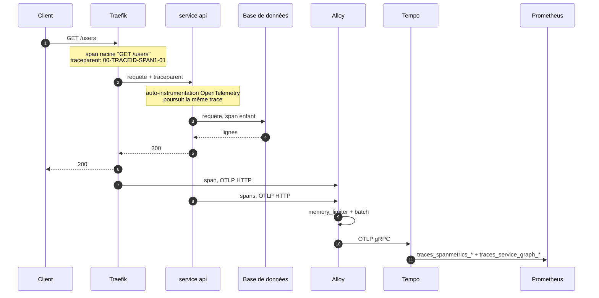

### 8.2 Anatomie d'une trace

```
Trace 8285620e9b55759362ba3ef621f399b0                        total 320 ms
└─ traefik       GET /users                                   320 ms
   └─ api        GET /users                                   310 ms
      ├─ api     request handler - /users                     305 ms
      └─ api     db.fetch-users                               280 ms   ← la partie lente
```

Chaque span enregistre un nom de service, un nom d'opération, une heure de début, une durée, un statut (ok ou erreur) et des attributs comme `http.request.method` ou `http.response.status_code`.

### 8.3 La chaîne OTLP d'Alloy

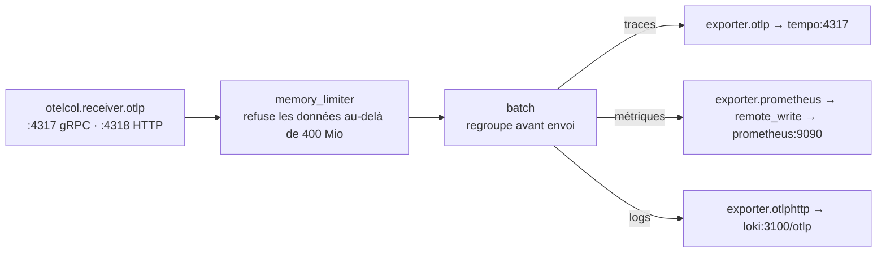

| Composant | Pourquoi il est là |
|---|---|
| `otelcol.receiver.otlp` | Point d'entrée unique pour toutes les applications et Traefik, en gRPC ou HTTP |
| `otelcol.processor.memory_limiter` | Si les données arrivent plus vite qu'elles ne partent, Alloy refuse les nouvelles au lieu de planter. Les SDK réessaient |
| `otelcol.processor.batch` | Envoie les données par lots : moins de requêtes vers les backends |
| Exporters | Un par destination. Remplacer un backend ne change que ce bloc |

Alloy est aussi l'endroit naturel pour ajouter du **tail sampling** (garder seulement les traces lentes ou en erreur) ou retirer des attributs sensibles avant stockage.

### 8.4 Stockage des traces dans Tempo

- **Mode monolithique** (`-target=all`) : tous les composants de Tempo tournent dans un seul processus. Tempo 3 n'a pas besoin de Kafka dans ce mode.
- **Stockage :** les spans reçus passent par un journal d'écriture (WAL), puis sont rangés en blocs compressés sur le disque local (`/var/tempo`).
- **Rétention :** les blocs plus anciens que `TEMPO_RETENTION` (7 jours par défaut) sont supprimés.
- **Recherche :** par identifiant de trace, ou en TraceQL sur n'importe quel attribut.

### 8.5 Metrics generator

Tempo lit les spans à leur arrivée et calcule deux familles de métriques, qu'il écrit dans Prometheus :

| Processeur | Métriques | Ce que vous obtenez |
|---|---|---|
| `span-metrics` | `traces_spanmetrics_calls_total`, `traces_spanmetrics_latency_bucket` | Métriques **RED** par service et opération : débit, erreurs, durée, avec des exemplars pointant vers de vraies traces |
| `service-graphs` | `traces_service_graph_request_total`, `traces_service_graph_request_failed_total` | Qui appelle qui, combien de fois, et combien d'appels échouent. Grafana le dessine en carte des services |

Vous obtenez des tableaux de bord de latence et d'erreurs pour chaque service instrumenté sans écrire une seule métrique à la main.

### 8.6 Requêtes TraceQL utiles

```traceql
# Requêtes lentes sur le service api
{ resource.service.name = "api" && span:duration > 500ms }

# Spans en erreur
{ span:status = error }

# 5xx vues en entrée
{ resource.service.name = "traefik" && span.http.response.status_code >= 500 }

# Traces passant par l'étape base de données
{ name = "db.fetch-users" }
```

---

## 9. Corrélation des signaux

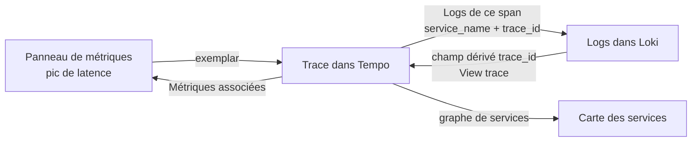

### Une investigation type

1. L'alerte `TraefikHighLatencyP95` arrive par e-mail pour le service `api`.
2. Dans Grafana, le panneau de latence montre le pic. Les points sur la courbe sont des **exemplars** : des mesures reliées à une vraie trace.
3. Un clic sur un exemplar ouvre la trace dans Tempo. Le span `db.fetch-users` prend 280 ms sur 320.
4. Depuis ce span, **Logs for this span** ouvre Loki, déjà filtré sur `service_name="api"` et cet identifiant de trace.
5. La ligne de log indique `slow query: missing index on orders.customer_id`.
6. Depuis n'importe quelle ligne portant un `trace_id`, **View trace** ramène à Tempo.

### Configuration des liens

Tous les liens sont provisionnés dans `grafana/provisioning/datasources/datasources.yml` :

| De | Vers | Mécanisme |
|---|---|---|
| Prometheus | Tempo | `exemplarTraceIdDestinations` : le label `trace_id` des exemplars ouvre Tempo |
| Tempo | Loki | `tracesToLogsV2` : associe `service.name` à `service_name`, filtre par identifiant de trace, cherche 5 minutes autour du span |
| Tempo | Prometheus | `tracesToMetrics` et `serviceMap` |
| Loki | Tempo | `derivedFields` sur la structured metadata `trace_id` ajoute un bouton **View trace** |

**La seule exigence :** `OTEL_SERVICE_NAME` doit être **identique au nom du service Compose**. Les traces portent `service.name`, fourni par le SDK ; les logs portent `service_name`, issu du label Compose. S'ils diffèrent, le lien trace → logs ne trouve rien.

---

## 10. Les fichiers de configuration

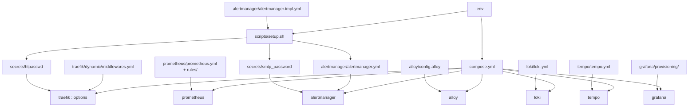

| Fichier | Ce qu'il contrôle | Ce qu'on y change en général |
|---|---|---|
| `.env` | Domaine, e-mail ACME, mots de passe, SMTP, rétention, versions | Tout ce qui est propre à votre serveur. Créé depuis `.env.example` |
| `compose.yml` | Tous les services, leurs réseaux, volumes, limites mémoire, et la configuration statique de Traefik | Limites mémoire, ajout d'un service à la stack |
| `scripts/setup.sh` | Valide `.env`, génère `secrets/htpasswd` et `secrets/smtp_password`, produit `alertmanager.yml` | Rien. Le relancer après avoir changé les accès admin ou SMTP |
| `traefik/dynamic/middlewares.yml` | Middlewares partagés et options TLS | Valeurs de limitation, en-têtes, ajout d'une liste d'IP autorisées ou d'un SSO |
| `prometheus/prometheus.yml` | Intervalle de collecte, cibles statiques, découverte Docker, adresse d'Alertmanager | Ajouter une cible qui n'est pas un conteneur (un hôte distant par exemple) |
| `prometheus/rules/*.yml` | Règles d'alerte | Seuils, nouvelles alertes |
| `alertmanager/alertmanager.tmpl.yml` | Regroupement, intervalles de répétition, inhibition, destinataires | Ajouter Slack, Telegram, Teams ou un webhook |
| `alloy/config.alloy` | Collecte et analyse des logs, chaînes OTLP | Règles d'analyse, échantillonnage, filtrage d'attributs |
| `loki/loki.yml` | Stockage, schéma, limites, rétention | Limites d'ingestion, passage du stockage sur S3 ou MinIO |
| `tempo/tempo.yml` | Récepteurs OTLP, stockage, metrics generator | Passage du stockage sur S3 ou MinIO |
| `grafana/provisioning/datasources/datasources.yml` | Les quatre datasources et leurs liens | Noms de labels si vous les changez dans Alloy |
| `grafana/provisioning/dashboards/dashboards.yml` | Charge les tableaux de bord JSON de `grafana/dashboards/` | Rien |

Les fichiers générés par `setup.sh` (`secrets/*`, `alertmanager/alertmanager.yml`) et `.env` sont ignorés par Git.

---

## 11. Installation

### 11.1 Prérequis

| Prérequis | Détail |
|---|---|
| Serveur | Linux avec Docker Engine et le plugin Compose v2.20 ou plus récent |
| Mémoire | Environ 3 Go utilisés sous charge modérée. Les limites mémoire totalisent environ 5 Go |
| Disque | 20 Go libres pour la rétention par défaut |
| Réseau | Ports 80 et 443 ouverts depuis Internet. Garder SSH ouvert dans le pare-feu |
| DNS | Enregistrements A ou AAAA vers le serveur pour `traefik`, `grafana`, `prometheus` et `alertmanager` sous votre domaine, plus un par application. Un joker `*.<DOMAIN>` convient aussi |
| SMTP | Un compte capable d'envoyer des e-mails, pour les alertes |

### 11.2 Étapes

```bash
git clone <ce-depot> observability-stack && cd observability-stack

# 1. Premier lancement : crée .env depuis .env.example et s'arrête
./scripts/setup.sh

# 2. Compléter .env : DOMAIN, ACME_EMAIL, mots de passe, réglages SMTP
$EDITOR .env

# 3. Second lancement : vérifie .env, génère les secrets et alertmanager.yml
./scripts/setup.sh

# 4. Démarrer la stack
docker compose up -d
docker compose ps
```

`setup.sh` refuse de continuer tant que `DOMAIN` vaut encore `example.com` ou qu'un mot de passe vaut encore `change-me-now`. Dans `.env`, les valeurs contenant `$` doivent être entre apostrophes, par exemple `ADMIN_PASSWORD='p$ss'`.

### 11.3 Ce qui se passe au premier démarrage

1. `volume-init` donne à Loki et Tempo la propriété de leurs volumes, puis s'arrête.
2. `socket-proxy` démarre, puis Traefik, Prometheus et Alloy s'y connectent.
3. Traefik découvre les routes de Grafana, Prometheus, Alertmanager et du dashboard, et demande leurs certificats. Cela prend quelques secondes par domaine.
4. Loki et Tempo démarrent. Alloy commence à envoyer les logs et attend les données OTLP.
5. Grafana crée son compte admin à partir de `GRAFANA_ADMIN_USER` et `GRAFANA_ADMIN_PASSWORD`, et provisionne les datasources.

### 11.4 Première connexion

| URL | Identifiants |
|---|---|
| `https://grafana.<DOMAIN>` | `GRAFANA_ADMIN_USER` / `GRAFANA_ADMIN_PASSWORD` |
| `https://traefik.<DOMAIN>` | `ADMIN_USER` / `ADMIN_PASSWORD` |
| `https://prometheus.<DOMAIN>` | `ADMIN_USER` / `ADMIN_PASSWORD` |
| `https://alertmanager.<DOMAIN>` | `ADMIN_USER` / `ADMIN_PASSWORD` |

Grafana enregistre son mot de passe admin dans sa base au premier démarrage. Modifier `GRAFANA_ADMIN_PASSWORD` ensuite n'a aucun effet : changez-le depuis l'interface de Grafana.

### 11.5 Réglage recommandé sur l'hôte

Limitez la taille des fichiers de logs Docker, puisqu'Alloy les lit via l'API Docker. Dans `/etc/docker/daemon.json` :

```json
{ "log-driver": "json-file", "log-opts": { "max-size": "10m", "max-file": "3" } }
```

Puis `sudo systemctl restart docker`. Le réglage s'applique aux conteneurs créés ensuite.

---

## 12. Intégrer une application

### 12.1 Les quatre étapes

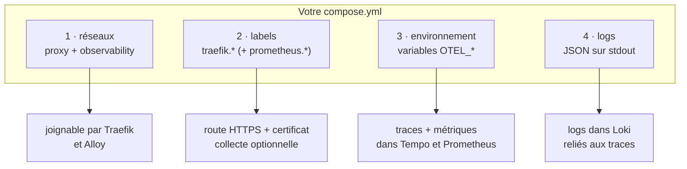

| Étape | Ce que vous ajoutez | Ce que vous obtenez |
|---|---|---|
| 1. Réseaux | `proxy` et `observability` en réseaux externes | Traefik peut router vers l'app. L'app peut joindre Alloy |
| 2. Labels | `traefik.*`, et `prometheus.*` si l'app expose `/metrics` | Route HTTPS, certificat, en-têtes de sécurité, logs d'accès, métriques de requêtes |
| 3. Environnement | Variables `OTEL_*` et un SDK ou agent OpenTelemetry | Traces dans Tempo, métriques applicatives, métriques RED, carte des services |
| 4. Logs | JSON sur stdout, avec un niveau en texte | Logs cherchables dans Loki, reliés aux traces |

### 12.2 Exemple complet

```yaml
services:
  api:
    image: ghcr.io/acme/api:1.4.0
    restart: unless-stopped
    environment:
      OTEL_SERVICE_NAME: api                          # = nom du service Compose
      OTEL_RESOURCE_ATTRIBUTES: deployment.environment.name=production,service.version=1.4.0
      OTEL_EXPORTER_OTLP_ENDPOINT: http://alloy:4318
      OTEL_EXPORTER_OTLP_PROTOCOL: http/protobuf
      OTEL_TRACES_EXPORTER: otlp
      OTEL_METRICS_EXPORTER: otlp
      OTEL_LOGS_EXPORTER: none                        # les logs passent déjà par stdout
    labels:
      traefik.enable: "true"
      traefik.http.routers.api.rule: Host(`api.example.com`)
      traefik.http.routers.api.entrypoints: websecure
      traefik.http.services.api.loadbalancer.server.port: "3000"
      # Seulement si l'app expose des métriques Prometheus :
      # prometheus.scrape: "true"
      # prometheus.port: "3000"
      # prometheus.path: /metrics
    networks: [proxy, observability]

networks:
  proxy:
    external: true
  observability:
    external: true
```

### 12.3 Les variables OpenTelemetry

| Variable | Valeur ici | Signification |
|---|---|---|
| `OTEL_SERVICE_NAME` | `api` | Nom affiché dans Tempo et Grafana. Doit être égal au nom du service Compose |
| `OTEL_RESOURCE_ATTRIBUTES` | `deployment.environment.name=production,service.version=1.4.0` | Attributs ajoutés à chaque span et métrique |
| `OTEL_EXPORTER_OTLP_ENDPOINT` | `http://alloy:4318` | Destination des données. `http://alloy:4317` en gRPC |
| `OTEL_EXPORTER_OTLP_PROTOCOL` | `http/protobuf` | `http/protobuf` pour le port 4318, `grpc` pour le port 4317 |
| `OTEL_TRACES_EXPORTER` | `otlp` | Envoyer les traces |
| `OTEL_METRICS_EXPORTER` | `otlp` | Envoyer les métriques |
| `OTEL_LOGS_EXPORTER` | `none` | Ne pas envoyer aussi les logs en OTLP, sinon chaque ligne serait stockée deux fois |

Ces variables font partie de la spécification OpenTelemetry : tous les SDK les lisent.

### 12.4 Instrumentation par langage

| Stack | Instrumentation sans code | Identifiant de trace dans les logs |
|---|---|---|
| **Node.js** (Express, NestJS, Fastify, serveur Next.js) | `npm i @opentelemetry/api @opentelemetry/auto-instrumentations-node`, démarrer avec `node --require @opentelemetry/auto-instrumentations-node/register` | Automatique avec **pino** ou **winston** : champs `trace_id`, `span_id` |
| **Python** (FastAPI, Django, Flask) | `pip install opentelemetry-distro opentelemetry-exporter-otlp`, `opentelemetry-bootstrap -a install`, démarrer avec `opentelemetry-instrument python app.py` | `OTEL_PYTHON_LOG_CORRELATION=true` |
| **Java** (Spring Boot) | `-javaagent:opentelemetry-javaagent.jar` | Clés MDC `trace_id`, `span_id` (Logback, Log4j) |
| **Go** | SDK plus instrumentations contrib (`otelhttp`, `otelsql`) | Ajouter `trace_id` depuis `trace.SpanContextFromContext` |
| **PHP** (Laravel, Symfony) | `ext-opentelemetry` plus paquets d'auto-instrumentation, `OTEL_PHP_AUTOLOAD_ENABLED=true` | Processor Monolog |
| **.NET** | `OpenTelemetry.AutoInstrumentation` | Scopes `ILogger` |

### 12.5 Recommandations sur le format des logs

| À faire | À éviter |
|---|---|
| Un objet JSON par ligne sur stdout | Texte sur plusieurs lignes, logs écrits dans des fichiers à l'intérieur du conteneur |
| Un niveau en texte : `"level":"error"` | Un niveau numérique : `"level":50` (défaut de pino) |
| Un champ `trace_id` (ajouté automatiquement par OpenTelemetry pour pino, winston, Logback, le logging Python) | Construire l'identifiant de trace à la main |
| Des noms de champs identiques d'un service à l'autre | Secrets, jetons, numéros de carte complets ou mots de passe dans les logs |

### 12.6 Exemple fonctionnel

`examples/node-app/` contient un service Express (`server.js`, `Dockerfile`, `compose.yml`, `package.json`) testé avec cette stack. Une requête sur `/users` produit :

- une trace `GET /users` → `request handler` → `db.fetch-users` dans Tempo ;
- une ligne de log JSON `users served` portant le même `trace_id` dans Loki ;
- les métriques du serveur HTTP dans Prometheus.

```bash
cd examples/node-app
sed -i 's/api.example.com/api.<DOMAIN>/' compose.yml
docker compose up -d --build
curl https://api.<DOMAIN>/users
```

### 12.7 Checklist développeur

- [ ] Conteneur sur les réseaux `proxy` et `observability`
- [ ] `traefik.enable=true`, un nom de routeur unique, une règle `Host()`, l'entrypoint `websecure`, le port du service
- [ ] Enregistrement DNS pour le domaine
- [ ] `OTEL_SERVICE_NAME` égal au nom du service Compose
- [ ] SDK ou agent OpenTelemetry chargé au démarrage
- [ ] Logs JSON sur stdout avec un niveau en texte
- [ ] Si `/metrics` est exposé : labels `prometheus.scrape` et `prometheus.port`

---

## 13. Liste de vérification

| Vérification | Comment | Résultat attendu |
|---|---|---|
| Conteneurs | `docker compose ps` | Tous `running`, Traefik, Prometheus et Alertmanager `healthy`, `volume-init` terminé avec le code 0 |
| TLS | `curl -I https://grafana.<DOMAIN>` | `200` ou `302`, certificat valide, en-tête `strict-transport-security` |
| Redirection HTTP | `curl -I http://grafana.<DOMAIN>` | `301` vers HTTPS |
| Auth admin | `curl -I https://prometheus.<DOMAIN>` | `401` sans identifiants |
| Cibles de collecte | Prometheus → *Status → Targets* | Toutes `UP` |
| Règles d'alerte | Prometheus → *Alerts* | 15 règles chargées |
| Lien Alertmanager | Prometheus → *Status → Runtime & Build Information* | Un Alertmanager découvert |
| Logs | Grafana → *Explore* → Loki → `{service_name="traefik"}` | Logs d'accès de Traefik |
| Traces | Grafana → *Explore* → Tempo → *Search* | Spans `traefik` après une requête |
| Graphe de services | Tempo → *Service Graph* | Nœuds après quelques minutes de trafic entre services |
| Corrélation | Une ligne Loki avec `trace_id` → *View trace* | La trace s'ouvre dans Tempo |
| E-mail | `docker compose exec alertmanager amtool alert add test severity=warning --alertmanager.url=http://localhost:9093` | E-mail reçu en 30 secondes environ |

---

## 14. Exploitation

### 14.1 Commandes courantes

```bash
docker compose ps                              # état
docker compose logs -f traefik                 # suivre un service
docker compose restart alloy                   # redémarrer un service
docker compose up -d                           # appliquer un changement de compose.yml ou .env
docker compose pull && docker compose up -d    # après un changement de versions dans .env
```

### 14.2 Dimensionnement (un hôte, trafic modéré)

| Service | Limite mémoire | Disque |
|---|---|---|
| Traefik | 256 Mo | < 1 Mo (`acme.json`) |
| Prometheus | 1 Go | Jusqu'à `PROMETHEUS_RETENTION_SIZE` (10 Go) |
| Loki | 1 Go | Environ 1 à 5 Go pour 14 jours, selon le volume de logs |
| Tempo | 1 Go | Environ 1 à 10 Go pour 7 jours, selon le trafic |
| Alloy | 512 Mo | Faible (positions de lecture, tampons) |
| Grafana | 512 Mo | < 500 Mo |
| cAdvisor, node-exporter, Alertmanager | 256 Mo, 64 Mo, 128 Mo | Négligeable |

### 14.3 Rétention

| Signal | Variable | Défaut | Appliquée par |
|---|---|---|---|
| Métriques | `PROMETHEUS_RETENTION_TIME` / `PROMETHEUS_RETENTION_SIZE` | 15 jours / 10 Go, la première limite atteinte | TSDB de Prometheus |
| Logs | `LOKI_RETENTION` | 336h (14 jours) | Compacteur de Loki |
| Traces | `TEMPO_RETENTION` | 168h (7 jours) | Compaction de Tempo |

Changer la valeur dans `.env`, puis `docker compose up -d`.

### 14.4 Sauvegardes

| Volume | Priorité | Contenu |
|---|---|---|
| `observability_grafana_data` | Haute | Utilisateurs, tableaux de bord modifiés dans l'interface, annotations, préférences |
| `observability_letsencrypt` | Moyenne | Certificats. Évite de les redemander et de toucher les limites de Let's Encrypt |
| `observability_alertmanager_data` | Faible | Mises en sourdine actives |
| `observability_prometheus_data` | Faible | Historique des métriques |
| `observability_loki_data`, `observability_tempo_data` | Faible | Durée de vie courte par conception |

La configuration est dans Git. Gardez une copie séparée et sécurisée de `.env` et `secrets/`.

```bash
# Sauvegarder Grafana (l'arrêter pour une copie SQLite cohérente)
docker compose stop grafana
docker run --rm -v observability_grafana_data:/data -v "$PWD":/backup busybox \
  tar czf /backup/grafana-$(date +%F).tgz -C /data .
docker compose start grafana

# Restaurer
docker compose stop grafana
docker run --rm -v observability_grafana_data:/data -v "$PWD":/backup busybox \
  sh -c 'rm -rf /data/* && tar xzf /backup/grafana-2026-09-17.tgz -C /data'
docker compose start grafana
```

### 14.5 Mises à jour

1. Lire les notes de version du composant. Attention aux changements de schéma de Loki, aux versions majeures de Tempo et aux versions mineures de Traefik.
2. Changer la version dans `.env`.
3. Appliquer à ce seul service :

```bash
docker compose pull <service> && docker compose up -d <service>
```

Les versions figées rendent les mises à jour délibérées. Un outil comme Renovate peut ouvrir une pull request à chaque nouvelle version.

### 14.6 Recharger sans redémarrer

| Composant | Comment |
|---|---|
| Middlewares Traefik | Automatique quand `traefik/dynamic/middlewares.yml` change |
| Routes Traefik | Automatique au démarrage ou à l'arrêt des conteneurs |
| Configuration et règles Prometheus | `docker compose exec prometheus wget -qO- --post-data='' http://localhost:9090/-/reload` |
| Tableaux de bord Grafana | Automatique en 30 s pour les fichiers de `grafana/dashboards/` |
| Alertmanager, Alloy, Loki, Tempo | `docker compose restart <service>` |

### 14.7 Quand un seul hôte ne suffit plus

| Contrainte | Étape suivante |
|---|---|
| Le volume de logs ou de traces remplit le disque | Passer le stockage de Loki et Tempo sur un stockage objet compatible S3 (MinIO, AWS S3, Backblaze B2) |
| Plusieurs serveurs à surveiller | Faire tourner node-exporter, cAdvisor et Alloy sur chaque hôte et envoyer vers cette stack centrale par des routes Traefik authentifiées |
| Métriques longue durée | Ajouter un `remote_write` de Prometheus vers Grafana Mimir ou Thanos |
| Haute disponibilité | Passer sur Kubernetes avec les charts Helm officiels. L'instrumentation des applications reste la même |

---

## 15. Renforcer la sécurité

La configuration par défaut est sûre pour un serveur unique. Pour des environnements plus exigeants :

| Mesure | Comment |
|---|---|
| Restreindre les interfaces d'administration par IP | Ajouter un middleware `ipAllowList` dans `middlewares.yml` avec `sourceRange: ["203.0.113.0/24"]` et le chaîner avant `admin-auth@file` |
| Authentification unique (SSO) | Remplacer `admin-auth` par un middleware `forwardAuth` pointant vers Authelia, authentik ou oauth2-proxy |
| SSO pour Grafana | Configurer l'OAuth générique de Grafana avec les variables `GF_AUTH_GENERIC_OAUTH_*` |
| Tester les certificats d'abord | Ajouter `--certificatesresolvers.letsencrypt.acme.caserver=https://acme-staging-v02.api.letsencrypt.org/directory` pour éviter les limites de production pendant les essais, puis le retirer et supprimer `acme.json` |
| Pare-feu | N'autoriser en entrée que 22, 80 et 443. Seuls 80 et 443 sont publiés par Docker ici : les règles iptables de Docker n'ouvrent donc rien d'autre |
| Rotation des secrets | Changer la valeur dans `.env`, lancer `./scripts/setup.sh`, puis `docker compose up -d` |
| Données sensibles dans la télémétrie | Retirer des attributs dans Alloy (`otelcol.processor.attributes`) ou supprimer des lignes de logs (`stage.drop`) avant stockage |

---

## 16. Dépannage

### Reverse proxy

| Symptôme | Cause probable | Correction |
|---|---|---|
| `404 page not found` | `traefik.enable=true` manquant, règle `Host` erronée, ou conteneur absent de `proxy` | Vérifier labels et réseaux. `docker compose logs traefik \| grep -i error` |
| *TRAEFIK DEFAULT CERT* dans le navigateur | Échec du challenge ACME | Le domaine doit pointer vers le serveur et le port 80 être joignable. `docker compose logs traefik \| grep -i acme` |
| `too many certificates already issued` | Limite de Let's Encrypt | Attendre, et utiliser le serveur de test pendant les essais (section 15) |
| `502 Bad Gateway` | `loadbalancer.server.port` erroné, ou l'app écoute sur `127.0.0.1` | Utiliser le port interne. Faire écouter l'app sur `0.0.0.0` |
| `401` sur Grafana | `admin-auth` ajouté au routeur Grafana | Grafana a sa propre connexion. Retirer le middleware |

### Monitoring

| Symptôme | Cause probable | Correction |
|---|---|---|
| Application absente des cibles | Pas sur `observability`, ou `prometheus.scrape`/`prometheus.port` manquant | Les ajouter, attendre 30 s |
| Cible `DOWN` | Mauvais port ou chemin, ou l'app n'expose pas de métriques | Vérifier `prometheus.port` et `prometheus.path` |
| Aucun e-mail d'alerte | Réglages ou mot de passe SMTP | Chercher `AlertmanagerNotificationsFailing`. `docker compose logs alertmanager` |
| Règles absentes après modification | Erreur de syntaxe, rechargement échoué | `promtool check rules` (section 6.4), puis recharger |

### Logs

| Symptôme | Cause probable | Correction |
|---|---|---|
| Aucun log pour un conteneur | Label `logging=false`, ou rien d'écrit sur stdout/stderr | Écrire sur stdout. `docker compose logs alloy` |
| Label `level` vide | Logs non JSON, ou niveau numérique | Émettre du JSON avec un niveau en texte (voir `examples/node-app/server.js`) |
| `entry too far behind` dans les logs d'Alloy | Anciennes lignes renvoyées après une longue coupure | Normal : les lignes de plus de 7 jours sont refusées |
| Requête trop lente | Requête sans sélecteur de labels précis | Toujours commencer par `{service_name="…"}` |

### Tracing

| Symptôme | Cause probable | Correction |
|---|---|---|
| Aucune trace d'une application | Mauvais endpoint, port ou protocole | HTTP : `http://alloy:4318` avec `http/protobuf`. gRPC : `http://alloy:4317` avec `grpc`. L'app doit être sur `observability` |
| Spans de Traefik et de l'app dans des traces séparées | Le framework n'est pas instrumenté, donc `traceparent` est ignoré | Charger l'agent ou l'auto-instrumentation OpenTelemetry au démarrage |
| Le lien trace → logs ne renvoie rien | `OTEL_SERVICE_NAME` différent du nom du service Compose | Aligner les deux noms |
| Graphe de services vide | Pas assez de trafic, ou un seul service instrumenté | Le graphe demande des appels entre au moins deux services instrumentés |
| Pas de métriques RED | Tempo ne peut pas écrire dans Prometheus | `docker compose logs tempo \| grep -i remote` |

### Accéder à l'interface d'Alloy pour déboguer

L'interface d'Alloy montre chaque composant et son état, mais elle n'est pas exposée. Pour l'ouvrir temporairement, ajoutez ces labels au service `alloy`, ajoutez-lui le réseau `proxy`, puis lancez `docker compose up -d alloy`. Retirez-les ensuite.

```yaml
labels:
  traefik.enable: "true"
  traefik.http.routers.alloy.rule: Host(`alloy.${DOMAIN}`)
  traefik.http.routers.alloy.entrypoints: websecure
  traefik.http.routers.alloy.middlewares: admin-auth@file
  traefik.http.services.alloy.loadbalancer.server.port: "12345"
```

---

## 17. Référence

### 17.1 Variables d'environnement (`.env`)

| Variable | Défaut | Utilisée par | Description |
|---|---|---|---|
| `DOMAIN` | `example.com` | Labels Traefik, Prometheus, Alertmanager, Grafana | Domaine de base. Les interfaces sont servies sur ses sous-domaines |
| `ACME_EMAIL` | `admin@example.com` | Traefik | E-mail du compte Let's Encrypt : avertissements d'expiration |
| `ADMIN_USER` / `ADMIN_PASSWORD` | `admin` / `change-me-now` | `setup.sh` → `secrets/htpasswd` | Basic auth du dashboard Traefik, de Prometheus et d'Alertmanager |
| `GRAFANA_ADMIN_USER` / `GRAFANA_ADMIN_PASSWORD` | `admin` / `change-me-now` | Grafana | Compte admin initial, au premier démarrage seulement |
| `ALERT_EMAIL_TO` | `ops@example.com` | `setup.sh` → Alertmanager | Destinataires, séparés par des virgules |
| `SMTP_HOST` | `smtp.example.com:587` | Alertmanager | Serveur et port SMTP, TLS obligatoire |
| `SMTP_FROM` / `SMTP_USER` | `alerts@example.com` | Alertmanager | Adresse d'expéditeur et identifiant SMTP |
| `SMTP_PASSWORD` | `change-me-now` | `setup.sh` → `secrets/smtp_password` | Mot de passe SMTP |
| `PROMETHEUS_RETENTION_TIME` | `15d` | Prometheus | Âge maximal des métriques |
| `PROMETHEUS_RETENTION_SIZE` | `10GB` | Prometheus | Taille disque maximale des métriques |
| `LOKI_RETENTION` | `336h` | Loki | Rétention des logs |
| `TEMPO_RETENTION` | `168h` | Tempo | Rétention des traces |
| `*_VERSION` | voir `.env.example` | Toutes les images | Versions d'images figées |

### 17.2 Labels Docker compris par la stack

| Label | Lu par | Obligatoire | Exemple |
|---|---|---|---|
| `traefik.enable` | Traefik | Oui, pour être routé | `"true"` |
| `traefik.http.routers.<nom>.rule` | Traefik | Oui | ``Host(`api.example.com`)`` |
| `traefik.http.routers.<nom>.entrypoints` | Traefik | Recommandé | `websecure` |
| `traefik.http.services.<nom>.loadbalancer.server.port` | Traefik | Si l'image expose plusieurs ports ou aucun | `"3000"` |
| `traefik.http.routers.<nom>.middlewares` | Traefik | Non | `compress@file,rate-limit@file` |
| `prometheus.scrape` | Prometheus | Oui, pour être collecté | `"true"` |
| `prometheus.port` | Prometheus | Oui, avec `prometheus.scrape` | `"3000"` |
| `prometheus.path` | Prometheus | Non, `/metrics` par défaut | `/internal/metrics` |
| `logging` | Alloy | Non | `"false"` pour exclure de la collecte des logs |

### 17.3 Ports

| Port | Service | Publié sur l'hôte | Protocole |
|---|---|---|---|
| 80 | Traefik `web` | Oui | HTTP, challenge ACME, redirection |
| 443 | Traefik `websecure` | Oui | HTTPS |
| 8081 | Traefik `ping` | Non | Healthcheck |
| 8082 | Traefik `metrics` | Non | Métriques Prometheus |
| 2375 | socket-proxy | Non | API Docker filtrée |
| 9090 | Prometheus | Non | Interface, API, remote write |
| 9093 | Alertmanager | Non | Interface, API |
| 9100 | node-exporter | Non | Métriques |
| 8080 | cAdvisor | Non | Métriques |
| 4317 / 4318 | Alloy | Non | OTLP gRPC / HTTP |
| 12345 | Alloy | Non | Interface, métriques |
| 3100 | Loki | Non | Envoi, requêtes, logs OTLP |
| 3200 | Tempo | Non | API de requêtes, métriques |
| 4317 | Tempo | Non | OTLP gRPC depuis Alloy |
| 3000 | Grafana | Non | Interface |

### 17.4 Volumes

| Volume | Monté dans | Contenu |
|---|---|---|
| `letsencrypt` | Traefik `/letsencrypt` | `acme.json` : certificats et compte ACME |
| `prometheus_data` | Prometheus `/prometheus` | Base de métriques |
| `alertmanager_data` | Alertmanager `/alertmanager` | Mises en sourdine, journal des notifications |
| `grafana_data` | Grafana `/var/lib/grafana` | Base SQLite, plugins |
| `alloy_data` | Alloy `/var/lib/alloy/data` | Positions de lecture des logs |
| `loki_data` | Loki `/loki` | Index, blocs, état du compacteur |
| `tempo_data` | Tempo `/var/tempo` | WAL, blocs de traces, WAL du generator |

Sur l'hôte, les volumes sont préfixés du nom du projet : `observability_grafana_data`, etc.

### 17.5 Organisation du dépôt

```
observability-stack/
├── compose.yml                          # toute la stack
├── .env.example                         # domaine, identifiants, rétention, versions figées
├── scripts/
│   └── setup.sh                         # valide .env, génère les secrets, produit la config Alertmanager
├── traefik/
│   └── dynamic/middlewares.yml          # en-têtes de sécurité, auth, compression, limitation, options TLS
├── prometheus/
│   ├── prometheus.yml                   # cibles statiques + découverte par labels Docker
│   └── rules/                           # alertes hôte, conteneurs, traefik, stack
├── alertmanager/
│   └── alertmanager.tmpl.yml            # routage, inhibition, destinataire e-mail
├── alloy/
│   └── config.alloy                     # chaînes logs Docker + traces/métriques/logs OTLP
├── loki/
│   └── loki.yml                         # binaire unique, TSDB v13, rétention, structured metadata
├── tempo/
│   └── tempo.yml                        # Tempo 3 monolithique, OTLP, metrics generator
├── grafana/
│   ├── provisioning/datasources/        # Prometheus, Loki, Tempo, Alertmanager + corrélations
│   ├── provisioning/dashboards/         # fournisseur de fichiers
│   └── dashboards/                      # vos tableaux de bord JSON
├── secrets/                             # générés par setup.sh, ignorés par Git
└── examples/
    └── node-app/                        # exemple d'intégration testé : Express + pino + OpenTelemetry
```

---

## 18. Choix de conception

| Choix | Plutôt que | Raison |
|---|---|---|
| **Loki** pour les logs | Elasticsearch + Kibana | N'indexe que les labels, pas le texte intégral. Demande une fraction de la mémoire (pas de heap JVM de 2 Go) et partage Grafana avec métriques et traces |
| **Tempo** pour les traces | Jaeger all-in-one | Stocke les traces sur disque local ou stockage objet, génère métriques RED et graphe de services, et se relie nativement à Loki et Prometheus |
| **Grafana Alloy** comme agent unique | Promtail + OpenTelemetry Collector | Promtail est en fin de vie depuis mars 2026. Alloy couvre les logs Docker et les chaînes OTLP dans un seul processus et une seule configuration |
| **OTLP** comme protocole applicatif | SDK propriétaires, clients Jaeger ou Zipkin | Standard neutre : les applications ne changent pas si le backend change |
| **Structured metadata** pour `trace_id` | Label indexé | Garde l'index de Loki petit tout en permettant recherche et liens |
| **Proxy du socket Docker** | Monter `docker.sock` dans Traefik, Prometheus et Alloy | Un composant compromis peut lire les métadonnées des conteneurs mais pas prendre la main sur l'hôte |
| **Configuration statique Traefik en options** | `traefik.yml` + options | Traefik n'accepte qu'une seule source statique. Les options lisent `${VAR}` depuis `.env` et évitent un fichier ignoré en silence |
| **Découverte par labels** | Modifier `prometheus.yml` pour chaque application | Ajouter une application ne touche jamais la stack d'observabilité |
| **Seuls 80 et 443 publiés** | Publier le port de chaque interface | Tout accès passe par TLS et authentification |
| **Metrics generator de Tempo** | Métriques de latence écrites à la main | Métriques RED pour chaque service instrumenté, sans code |
| **Versions d'images figées** | Tags `latest` | Déploiements reproductibles, mises à jour délibérées |
| **Limites mémoire sur chaque service** | Conteneurs sans limite | Un composant qui s'emballe ne peut pas faire tomber l'hôte |

---

## 19. Glossaire

| Terme | Définition |
|---|---|
| **ACME** | Protocole utilisé par Let's Encrypt pour vérifier la propriété d'un domaine et délivrer des certificats |
| **Cardinalité** | Nombre de combinaisons distinctes de labels. Une cardinalité élevée rend les bases de métriques et de logs lentes et coûteuses |
| **Compacteur** | Processus de fond de Loki et Tempo qui fusionne les données et supprime ce qui dépasse la rétention |
| **Entrypoint** | Port sur lequel Traefik écoute |
| **Exemplar** | Une mesure de métrique qui porte un identifiant de trace, reliant un point d'un graphique à une vraie requête |
| **Inhibition** | Règle d'Alertmanager qui masque certaines alertes tant qu'une alerte liée, plus grave, est active |
| **LogQL** | Langage de requête de Loki |
| **Middleware** | Composant Traefik qui modifie une requête ou une réponse : en-têtes, authentification, compression |
| **OTLP** | OpenTelemetry Protocol, utilisé pour envoyer traces, métriques et logs |
| **PromQL** | Langage de requête de Prometheus |
| **RED** | Rate, Errors, Duration (débit, erreurs, durée) : les trois métriques clés d'un service qui traite des requêtes |
| **Remote write** | Protocole pour pousser des métriques dans Prometheus au lieu de les collecter |
| **Router** | Règle Traefik qui associe des requêtes à un service |
| **Scrape** | Collecte de métriques par Prometheus sur un endpoint HTTP |
| **Graphe de services** | Carte des appels entre services, déduite des traces |
| **Span** | Une opération chronométrée dans une trace : une requête HTTP, une requête SQL |
| **Structured metadata** | Données clé-valeur de Loki attachées à une ligne de log, cherchables mais non indexées |
| **Trace** | L'arbre complet des spans produits par une requête |
| **traceparent** | En-tête HTTP W3C qui transporte le contexte de trace entre services |
| **TraceQL** | Langage de requête de Tempo |
| **WAL** | Write-ahead log, journal d'écriture : les données sont écrites sur disque avant traitement, pour ne rien perdre en cas de plantage |
