# Observability Stack

### Reverse proxy · Monitoring · Logs · Tracing — on a single Docker host

**English** · [Français](README.fr.md)

This repository runs a complete, self-hosted observability platform with Docker Compose. It does two jobs:

1. **It is the front door of the server.** Traefik receives all HTTP and HTTPS traffic, obtains TLS certificates automatically and routes each domain to the right container.
2. **It shows what happens inside.** It collects the three signals of observability (**metrics**, **logs** and **traces**), stores them, raises alerts and lets you move from one signal to another in Grafana.

Adding an application requires no change to this stack: the application declares a few Docker labels and environment variables, and everything else is automatic.

| Pillar | Components | Answers the question |
|---|---|---|
| Reverse proxy / TLS | Traefik v3, Let's Encrypt, Docker socket proxy | *How does traffic reach my services, securely?* |
| Monitoring | Prometheus, Alertmanager, node-exporter, cAdvisor, Grafana | *Is everything healthy right now? Who gets told when it is not?* |
| Logs | Grafana Alloy, Loki | *What exactly did the application say?* |
| Tracing | OpenTelemetry, Grafana Alloy, Tempo | *Where did this request spend its time, and where did it fail?* |

---

## Table of contents

**Understand**
1. [Key concepts](#1-key-concepts)
2. [Architecture overview](#2-architecture-overview)
3. [Components](#3-components)
4. [Networks and security model](#4-networks-and-security-model)

**How each pillar works**

5. [Reverse proxy and TLS](#5-reverse-proxy-and-tls)
6. [Monitoring and alerting](#6-monitoring-and-alerting)
7. [Logs](#7-logs)
8. [Tracing](#8-tracing)
9. [Correlation between signals](#9-correlation-between-signals)
10. [Configuration files explained](#10-configuration-files-explained)

**Use**

11. [Installation](#11-installation)
12. [Integrating an application](#12-integrating-an-application)
13. [Verification checklist](#13-verification-checklist)

**Operate**

14. [Operations](#14-operations)
15. [Security hardening](#15-security-hardening)
16. [Troubleshooting](#16-troubleshooting)
17. [Reference](#17-reference)
18. [Design decisions](#18-design-decisions)
19. [Glossary](#19-glossary)

---

## 1. Key concepts

If you already know Prometheus, Loki and OpenTelemetry, skip to [section 2](#2-architecture-overview).

### The three signals

| Signal | What it is | Example | Good for | Stored in |
|---|---|---|---|---|
| **Metric** | A number measured over time, with labels | `traefik_service_requests_total{service="api", code="500"} = 42` | Trends, dashboards, alerts. Cheap to keep for weeks | Prometheus |
| **Log** | A timestamped text line written by a program | `{"level":"error","msg":"payment refused","trace_id":"4bf9…"}` | The detailed "why" of an event | Loki |
| **Trace** | The path of one request across services, made of timed **spans** | `GET /orders` 320 ms → `db.query` 280 ms | Latency breakdown, locating the failing hop | Tempo |

The three work best together. A **metric** tells you *something is wrong* (latency went up). A **trace** tells you *where* (the database call). The **logs** of that trace tell you *why* (a missing index, a timeout).

### Pull and push

- **Pull (scrape):** Prometheus calls `http://target/metrics` every 15 seconds. Used for infrastructure: Traefik, the host, containers.
- **Push:** the application sends its data. Used for traces and application metrics, over **OTLP**.

### OpenTelemetry and OTLP

**OpenTelemetry** is the vendor-neutral standard for producing telemetry. Its SDKs exist for every major language and can instrument common frameworks automatically. **OTLP** is its wire protocol, on port 4317 (gRPC) or 4318 (HTTP). An application instrumented once with OpenTelemetry can send to any compatible backend without code changes.

### Labels and cardinality

Metrics and log streams are identified by **labels** (`service="api"`, `level="error"`). Each unique combination of labels is a separate series or stream. **Cardinality** is the number of those combinations. Putting a value that changes on every request (a user ID, a trace ID) into a label creates millions of series and overloads the database. That is why this stack keeps `trace_id` **out** of Loki's labels and stores it as *structured metadata* instead (see [section 7](#7-logs)).

### Context propagation

When Traefik forwards a request, it adds a `traceparent` HTTP header (W3C Trace Context standard) that carries the trace ID. Each instrumented service reads it and attaches its own spans to the same trace. This is how one trace can cover the proxy, the API and the database.

---

## 2. Architecture overview

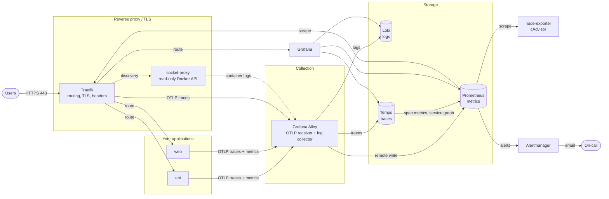

**Reading the diagram, from left to right:**

1. **Traefik** receives every request from the Internet, terminates TLS, forwards the request to the right container and starts a trace.
2. **Applications** handle the request and push their spans and metrics over OTLP to **Alloy**.
3. **Alloy** also reads the stdout/stderr of every container through the socket proxy.
4. Alloy sends each signal to its store: logs to **Loki**, traces to **Tempo**, metrics to **Prometheus**.
5. **Tempo** derives request rate, error rate and duration from spans and writes them to Prometheus.
6. **Prometheus** also scrapes Traefik, the host (node-exporter) and containers (cAdvisor), evaluates alert rules and sends firing alerts to **Alertmanager**, which emails the on-call person.
7. **Grafana** queries the three stores and links them together.

### One request, end to end

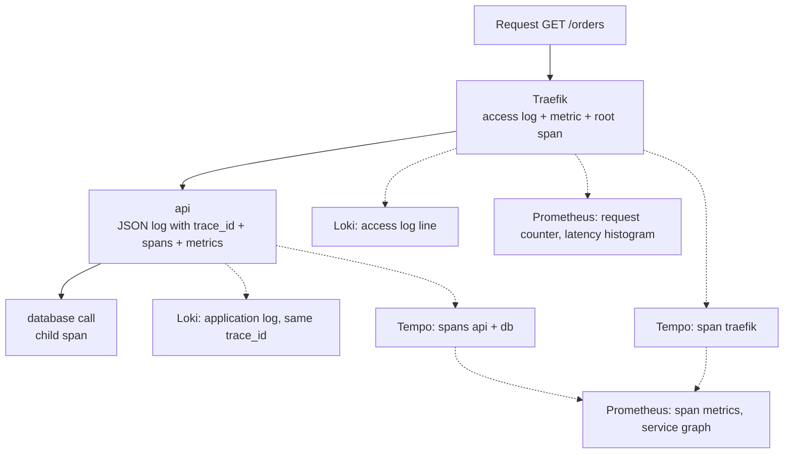

A single request produces data in all three stores, and every piece carries the same trace ID or service name, which is what makes correlation possible.

---

## 3. Components

| Service | Image and version | Role | Internal ports | Public URL |
|---|---|---|---|---|
| `traefik` | `traefik:v3.7.13` | Reverse proxy, TLS termination, access logs, request metrics, root spans | 80, 443, 8082 metrics, 8081 ping | `traefik.<DOMAIN>` (basic auth) |
| `socket-proxy` | `tecnativa/docker-socket-proxy:v0.5.0` | Read-only HTTP filter in front of `docker.sock` | 2375 | — |
| `prometheus` | `prom/prometheus:v3.14.0` | Metrics database, scraping, alert rule evaluation, remote-write receiver | 9090 | `prometheus.<DOMAIN>` (basic auth) |
| `alertmanager` | `prom/alertmanager:v0.34.1` | Deduplicates, groups, silences and routes alerts, sends email | 9093 | `alertmanager.<DOMAIN>` (basic auth) |
| `node-exporter` | `prom/node-exporter:v1.12.1` | Host metrics: CPU, memory, disks, network, filesystem | 9100 | — |
| `cadvisor` | `ghcr.io/google/cadvisor:0.60.5` | Per-container CPU, memory, throttling, network | 8080 | — |
| `alloy` | `grafana/alloy:v1.19.2` | Collection agent: Docker logs, OTLP receiver for traces, metrics and logs | 4317 gRPC, 4318 HTTP, 12345 UI | — |
| `loki` | `grafana/loki:3.7.7` | Log database: label index + compressed chunks, retention | 3100 | — |
| `tempo` | `grafana/tempo:3.0.3` | Trace database, span metrics and service graph generation | 3200 API, 4317 OTLP | — |
| `grafana` | `grafana/grafana:13.2.2` | Dashboards, exploration, correlation between signals | 3000 | `grafana.<DOMAIN>` (Grafana login) |
| `volume-init` | `busybox:1.37` | One-shot container: gives Loki and Tempo ownership of their volumes, then exits | — | — |

All versions are pinned in `.env` and were checked in September 2026.

---

## 4. Networks and security model

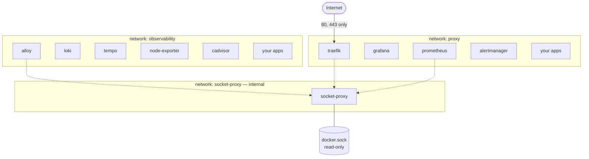

A container can join several networks. Traefik, Prometheus and your applications sit on two, which is how they bridge zones.

| Network | Members | Purpose |
|---|---|---|
| `proxy` | Traefik and every service it routes to | Carries public traffic from Traefik to services |
| `observability` | Telemetry backends and applications | Applications send OTLP to Alloy. Prometheus scrapes targets |
| `socket-proxy` | socket-proxy, Traefik, Prometheus, Alloy | Docker API access only. Declared `internal`: no route to the Internet |

The `proxy` and `observability` networks have **fixed names**, so other Compose projects can join them as `external` networks.

### Security layers

| Layer | Measure |
|---|---|
| Host exposure | Only ports 80 and 443 are published. No database, exporter or backend port is reachable from outside |
| Transport | HTTP is redirected to HTTPS. TLS 1.2 minimum, AEAD ciphers only, strict SNI, HSTS with preload |
| Admin interfaces | Traefik dashboard, Prometheus and Alertmanager require bcrypt basic auth. Grafana uses its own accounts, with sign-up disabled |
| Internal backends | Loki, Tempo and Alloy have no public route at all |
| Docker API | Only the socket proxy mounts `docker.sock`, and it only allows reading containers, networks, events and the version. `POST` is denied: nothing can create, stop or exec into a container through it. cAdvisor also mounts Docker directories read-only to read container statistics |
| Secrets | Passwords live in `.env` and `secrets/`, both ignored by Git. Alertmanager reads the SMTP password from a file, never from its configuration |
| Resource isolation | Every service has a memory limit, so a runaway component cannot starve the host |

---

## 5. Reverse proxy and TLS

### 5.1 Vocabulary

| Traefik term | Meaning |
|---|---|
| **Entrypoint** | A port Traefik listens on (`web` = 80, `websecure` = 443) |
| **Router** | A rule that matches requests (for example `Host(\`api.example.com\`)`) and sends them to a service |
| **Service** | The backend that receives matched requests: container IP and port |
| **Middleware** | A transformation applied between router and service: headers, auth, compression, rate limit |
| **Provider** | Where Traefik reads its routing configuration: Docker labels or a directory of files |
| **Certificate resolver** | The mechanism that obtains certificates, here Let's Encrypt |

### 5.2 Request lifecycle

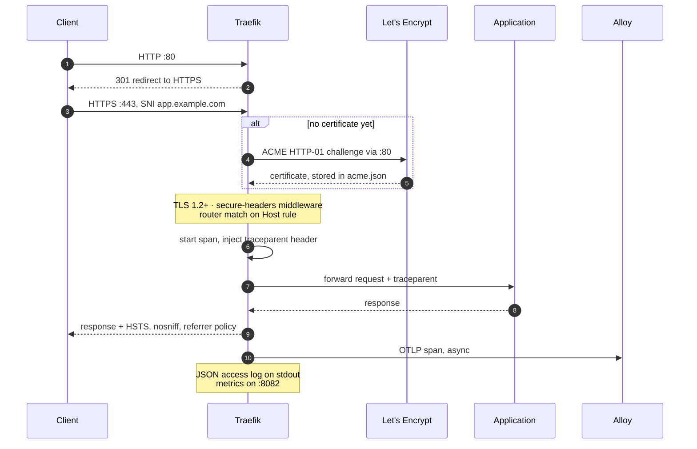

### 5.3 Two sources of configuration

Traefik separates **static** configuration (read once at start-up) from **dynamic** configuration (reloaded while running).

| Kind | Where in this repository | Contains | Reload |
|---|---|---|---|
| Static | `command:` flags of the `traefik` service in `compose.yml` | Entrypoints, certificate resolver, providers, metrics, tracing, logs | Restart Traefik |
| Dynamic, from Docker | Labels on each container | Routers and services of your applications | Automatic when containers start or stop |
| Dynamic, from files | `traefik/dynamic/middlewares.yml` | Shared middlewares and TLS options | Automatic when the file changes |

Static configuration is written as command-line flags, not as a `traefik.yml` file, for two reasons. Traefik accepts **only one** static source at a time, so mixing a file and flags would make one of them silently ignored. And flags can use `${DOMAIN}` and `${ACME_EMAIL}` straight from `.env`.

### 5.4 Entrypoints

| Entrypoint | Address | Purpose |
|---|---|---|
| `web` | `:80` | Answers the Let's Encrypt HTTP-01 challenge, then redirects everything else to HTTPS with a 301 |
| `websecure` | `:443` | All real traffic. The Let's Encrypt resolver and the `secure-headers` middleware apply to every router by default |
| `metrics` | `:8082` | Prometheus metrics. Not published |
| `ping` | `:8081` | Used by the container healthcheck. Not published |

### 5.5 How a certificate is obtained

1. A container with a new `Host()` rule starts. Traefik sees it through the socket proxy.
2. Because `websecure` uses the `letsencrypt` resolver, Traefik asks Let's Encrypt for a certificate for that domain.
3. Let's Encrypt calls `http://<domain>/.well-known/acme-challenge/…` on port 80. Traefik answers that path before applying the HTTPS redirect.
4. The certificate is stored in `acme.json` in the `letsencrypt` volume and renewed automatically about 30 days before expiry.
5. Prometheus watches the expiry date: `TraefikCertificateExpiringSoon` fires if a certificate is less than 14 days from expiry, which means renewal is failing.

**Requirements:** the domain must resolve to the server, and port 80 must be reachable from the Internet.

### 5.6 Shared middlewares

Defined in `traefik/dynamic/middlewares.yml` and referenced from labels with the `@file` suffix.

| Middleware | Applied | What it does |
|---|---|---|
| `secure-headers@file` | Automatically, on every HTTPS router | `Strict-Transport-Security` 1 year + subdomains + preload, `X-Content-Type-Options: nosniff`, `X-Frame-Options: SAMEORIGIN`, `Referrer-Policy: strict-origin-when-cross-origin`, a restrictive `Permissions-Policy`, and removal of `Server` and `X-Powered-By` |
| `admin-auth@file` | Traefik dashboard, Prometheus, Alertmanager | Basic authentication against `secrets/htpasswd` (bcrypt). The `Authorization` header is removed before reaching the backend |
| `compress@file` | Opt-in (Grafana uses it) | gzip / brotli compression of responses |
| `rate-limit@file` | Opt-in | 100 requests per second on average, bursts up to 200, per client IP |

### 5.7 Adding a route

```yaml
labels:
  traefik.enable: "true"
  traefik.http.routers.shop.rule: Host(`shop.example.com`)
  traefik.http.routers.shop.entrypoints: websecure
  traefik.http.services.shop.loadbalancer.server.port: "8080"
  # optional
  traefik.http.routers.shop.middlewares: compress@file,rate-limit@file
```

The router name (`shop` here) must be unique on the host. The container must be on the `proxy` network.

---

## 6. Monitoring and alerting

### 6.1 Where metrics come from

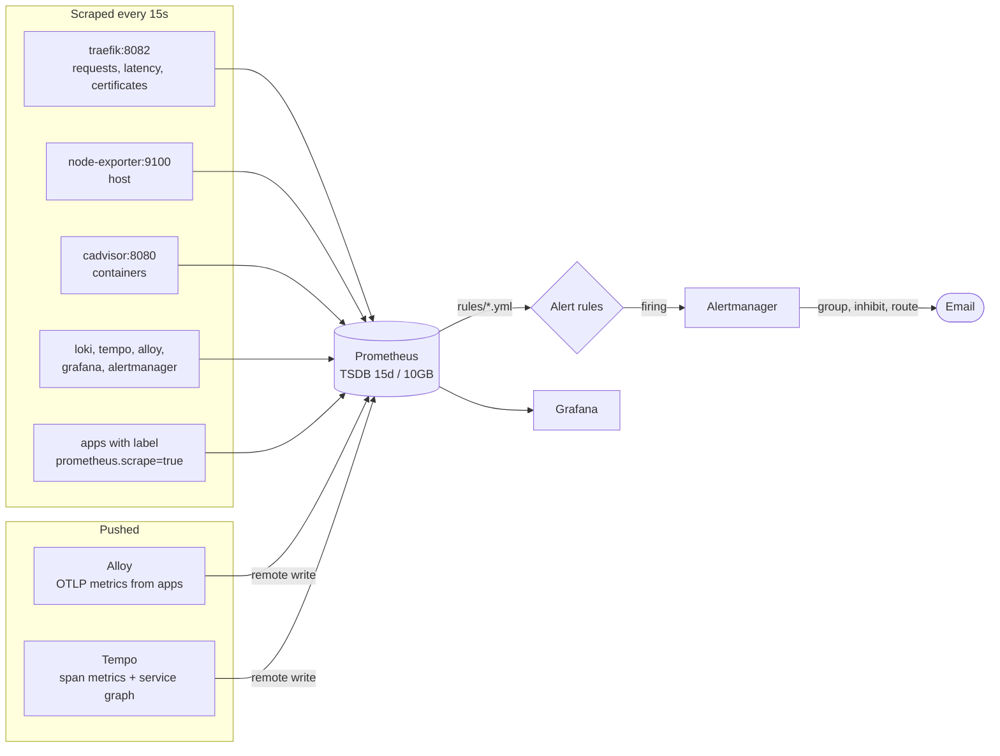

| Source | Collected how | Main metrics |
|---|---|---|
| Traefik | Scrape `traefik:8082` | `traefik_service_requests_total`, `traefik_service_request_duration_seconds`, `traefik_tls_certs_not_after` |
| Host | Scrape node-exporter | `node_cpu_seconds_total`, `node_memory_MemAvailable_bytes`, `node_filesystem_avail_bytes` |
| Containers | Scrape cAdvisor | `container_memory_working_set_bytes`, `container_cpu_usage_seconds_total`, `container_cpu_cfs_throttled_periods_total` |
| The stack itself | Scrape each component | Health of Prometheus, Loki, Tempo, Alloy, Grafana, Alertmanager |
| Applications, OTLP | Push to Alloy, which remote-writes to Prometheus | HTTP server duration, runtime metrics, custom metrics |
| Applications, `/metrics` | Scrape, discovered through labels | Whatever the application exposes |
| Tempo | Remote write | `traces_spanmetrics_*`, `traces_service_graph_*` |

### 6.2 Automatic discovery of applications

The `docker-apps` job in `prometheus/prometheus.yml` asks the Docker API, through the socket proxy, for the list of containers every 30 seconds, then filters and rewrites it:

| Step | Relabel rule | Effect |
|---|---|---|
| 1 | Keep if label `prometheus.scrape` = `true` | Containers without the label are ignored |
| 2 | Keep only the address on network `observability` | Prometheus can only reach containers on that network |
| 3 | `__address__` = network IP + label `prometheus.port` | Tells Prometheus where to connect |
| 4 | `__metrics_path__` = label `prometheus.path` (if set) | Default path is `/metrics` |
| 5 | Add labels `container`, `service`, `project` | Lets you filter metrics by Compose service and project |

Adding a scraped application therefore never requires editing `prometheus.yml`.

### 6.3 Lifecycle of an alert

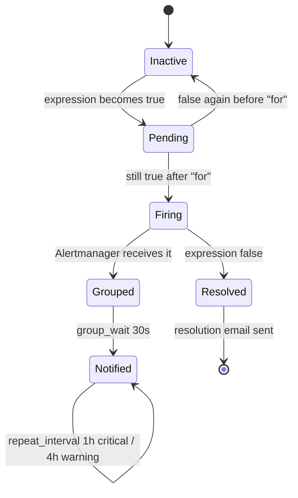

1. Prometheus evaluates every rule every 15 seconds.
2. When an expression becomes true, the alert is **pending**. It becomes **firing** only if it stays true for the rule's `for` duration, which prevents alerts on short spikes.
3. Alertmanager **groups** alerts with the same `alertname` and `severity`, waits 30 seconds to collect related alerts, then sends one email.
4. **Inhibition:** a `critical` alert suppresses the `warning` alert with the same name on the same instance, so you are not notified twice for the same problem.
5. While the problem lasts, the email is repeated every hour for `critical` and every 4 hours for `warning`. `info` alerts are recorded but never emailed.
6. When the expression turns false, a resolution email is sent.

### 6.4 Alert rules

| File | Alert | Condition | Severity |
|---|---|---|---|
| `host.yml` | `HostDown` | node-exporter unreachable for 2 min | critical |
| | `HostHighCpuLoad` | CPU above 85% for 10 min | warning |
| | `HostOutOfMemory` | Less than 10% memory available for 5 min | critical |
| | `HostDiskAlmostFull` | Less than 10% free on a writable filesystem | critical |
| | `HostDiskWillFillIn24h` | Linear prediction over 6h says the disk fills within 24h | warning |
| `containers.yml` | `ContainerMemoryNearLimit` | Above 90% of its memory limit for 5 min | warning |
| | `ContainerCpuThrottled` | More than 25% of CPU periods throttled for 10 min | warning |
| | `ContainerDisappeared` | Container not seen for 2 min | warning |
| `traefik.yml` | `TraefikHigh5xxRate` | More than 5% of responses are 5xx for a service | critical |
| | `TraefikHighLatencyP95` | p95 latency above 1s for 10 min | warning |
| | `TraefikCertificateExpiringSoon` | Certificate expires in less than 14 days | warning |
| `stack.yml` | `TargetDown` | Any scrape target down for 5 min | warning |
| | `PrometheusConfigReloadFailed` | Last configuration reload failed | warning |
| | `AlertmanagerNotificationsFailing` | Emails cannot be delivered | critical |
| | `PrometheusStorageNearRetentionSize` | Storage above 90% of the size limit | info |

**Adding a rule:** create or edit a file in `prometheus/rules/`, check it, then reload Prometheus:

```bash
docker compose exec prometheus sh -c 'promtool check rules /etc/prometheus/rules/*.yml'
docker compose exec prometheus wget -qO- --post-data='' http://localhost:9090/-/reload
```

### 6.5 Dashboards

Grafana is provisioned with its datasources but no dashboards. Import these community dashboards (*Dashboards → New → Import*, then choose the Prometheus datasource):

| ID | Dashboard | Shows |
|---|---|---|
| `1860` | Node Exporter Full | CPU, memory, disk and network of the host |
| `17346` | Traefik Official Standalone Dashboard | Requests, status codes and latency per service and entrypoint |

To version your own dashboards, export them as JSON into `grafana/dashboards/`. Grafana loads that folder every 30 seconds into the *Observability* folder.

---

## 7. Logs

### 7.1 Pipeline

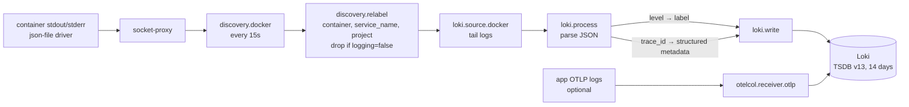

### 7.2 What happens to a log line

Take this line printed by the `api` container:

```json
{"level":"error","time":1789646704759,"trace_id":"8285620e9b55759362ba3ef621f399b0","msg":"payment refused"}
```

| Step | Alloy component | Result |
|---|---|---|
| 1. Discovery | `discovery.docker` | Alloy knows the container exists (it refreshes the list every 15 s) |
| 2. Labels | `discovery.relabel` | Stream labels: `container="shop-api-1"`, `service_name="api"`, `project="shop"` |
| 3. Collection | `loki.source.docker` | Alloy reads the new line from the Docker API and remembers its position, so nothing is read twice after a restart |
| 4. Parsing | `stage.json` | Extracts `level` = `error` and `trace_id` = `8285…`. It also accepts `severity`, `lvl`, `traceId`, `TraceId` |
| 5. Indexed label | `stage.labels` | `level="error"` becomes a label: only a handful of values exist, so it is cheap to index |
| 6. Metadata | `stage.structured_metadata` | `trace_id` is attached to the line but not indexed |
| 7. Storage | `loki.write` | Sent to Loki, which compresses lines into chunks and indexes only the labels |

Lines that are not JSON skip steps 4 to 6 and are stored unchanged, so plain-text logs still work.

### 7.3 Labels versus structured metadata

| | Label | Structured metadata |
|---|---|---|
| Examples here | `service_name`, `container`, `project`, `level` | `trace_id` |
| Indexed | Yes | No |
| Number of distinct values | Must stay small | Can be unlimited |
| Query syntax | `{service_name="api"}` | `{service_name="api"} \| trace_id="…"` |

A label with one value per request would create one stream per request and slow Loki down. Structured metadata gives the same search and linking ability without that cost.

### 7.4 How Loki stores and expires logs

Loki runs as a single binary with local filesystem storage:

- **Index:** TSDB format, schema v13, one index file per day. It only records which label sets exist in which chunks.
- **Chunks:** compressed blocks of log lines in `/loki/chunks`.
- **Retention:** the compactor deletes data older than `LOKI_RETENTION` (14 days by default).
- **Protection:** ingestion is limited to 8 MB/s with bursts of 16 MB, and lines older than 7 days are rejected.

Loki also adds `detected_level` automatically, and the pattern ingester groups similar lines so Grafana can show log patterns.

### 7.5 Useful LogQL queries

```logql
# All errors of a service
{service_name="api", level="error"}

# The logs of one request, from its trace id
{service_name="api"} | trace_id="4bf92f3577b34da6a3ce929d0e0e4736"

# Text search inside a service
{service_name="api"} |= "timeout"

# 5xx responses seen by Traefik
{service_name="traefik"} | json | DownstreamStatus >= 500

# Slowest routes according to Traefik (duration in nanoseconds)
{service_name="traefik"} | json | Duration > 1000000000

# Error lines per second, per service
sum by (service_name) (rate({level="error"}[5m]))
```

To exclude a noisy container from collection, add the label `logging: "false"`.

---

## 8. Tracing

### 8.1 Trace path

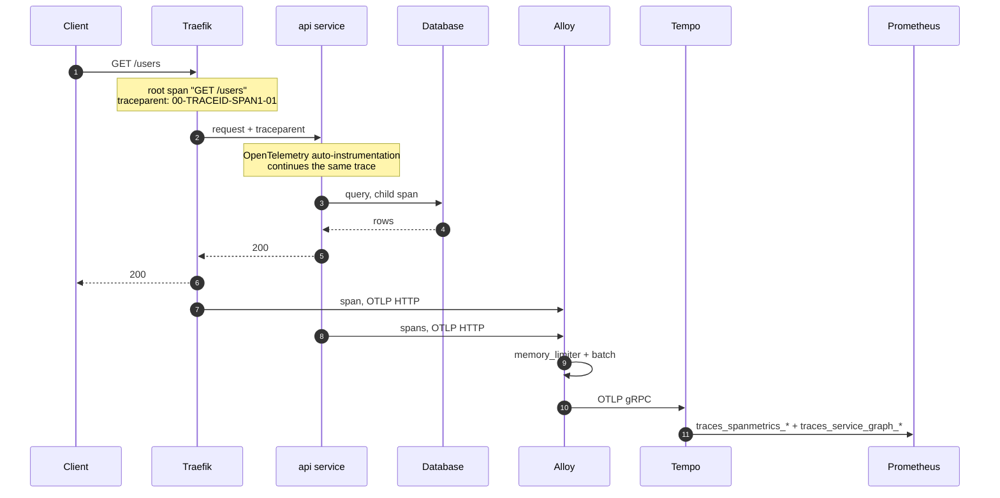

### 8.2 Anatomy of a trace

```
Trace 8285620e9b55759362ba3ef621f399b0                        total 320 ms
└─ traefik       GET /users                                   320 ms
   └─ api        GET /users                                   310 ms
      ├─ api     request handler - /users                     305 ms
      └─ api     db.fetch-users                               280 ms   ← the slow part
```

Each span records a service name, an operation name, a start time, a duration, a status (ok or error) and attributes such as `http.request.method` or `http.response.status_code`.

### 8.3 Alloy's OTLP pipeline

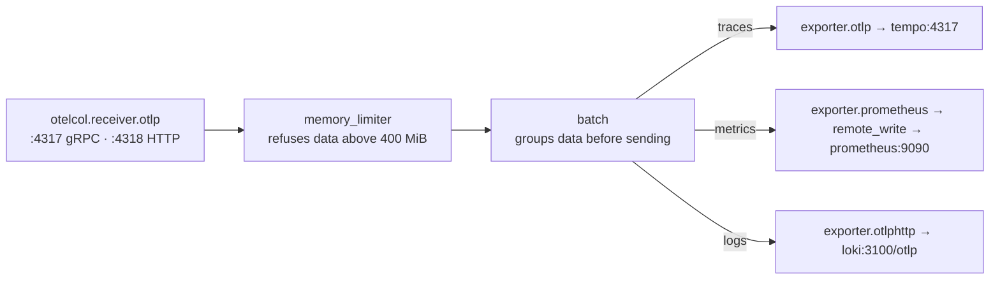

| Component | Why it is there |
|---|---|
| `otelcol.receiver.otlp` | Single entry point for all applications and Traefik, in gRPC or HTTP |
| `otelcol.processor.memory_limiter` | If data arrives faster than it can be sent, Alloy refuses new data instead of crashing. SDKs retry |
| `otelcol.processor.batch` | Sends data in groups: fewer requests to the backends |
| Exporters | One per destination. Replacing a backend only changes this block |

Alloy is also the natural place to add **tail sampling** (keeping only slow or failed traces) or to remove sensitive attributes before storage.

### 8.4 How Tempo stores traces

- **Monolithic mode** (`-target=all`): all Tempo components run in one process. Tempo 3 needs no Kafka in this mode.
- **Storage:** incoming spans go to a write-ahead log, then to compressed blocks on the local disk (`/var/tempo`).
- **Retention:** blocks older than `TEMPO_RETENTION` (7 days by default) are deleted.
- **Search:** by trace ID, or with TraceQL on any attribute.

### 8.5 Metrics generator

Tempo reads the spans as they arrive and computes two families of metrics, which it writes into Prometheus:

| Processor | Metrics | Gives you |
|---|---|---|
| `span-metrics` | `traces_spanmetrics_calls_total`, `traces_spanmetrics_latency_bucket` | **RED** metrics per service and operation: rate, errors, duration, with exemplars pointing to real traces |
| `service-graphs` | `traces_service_graph_request_total`, `traces_service_graph_request_failed_total` | Who calls whom, how often, and how often it fails. Grafana draws it as a service map |

You get latency and error dashboards for every instrumented service without writing a single metric by hand.

### 8.6 Useful TraceQL queries

```traceql
# Slow requests on the api service
{ resource.service.name = "api" && span:duration > 500ms }

# Failed spans
{ span:status = error }

# 5xx seen at the edge
{ resource.service.name = "traefik" && span.http.response.status_code >= 500 }

# Traces going through the database step
{ name = "db.fetch-users" }
```

---

## 9. Correlation between signals

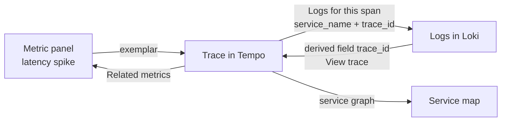

### A typical investigation

1. The `TraefikHighLatencyP95` alert arrives by email for the `api` service.
2. In Grafana, the latency panel shows the spike. Dots on the graph are **exemplars**: samples linked to a real trace.
3. Clicking an exemplar opens the trace in Tempo. The `db.fetch-users` span takes 280 ms out of 320 ms.
4. From that span, **Logs for this span** opens Loki, already filtered on `service_name="api"` and that trace ID.
5. The log line says `slow query: missing index on orders.customer_id`.
6. From any log line with a `trace_id`, **View trace** goes back to Tempo.

### How the links are configured

All links are provisioned in `grafana/provisioning/datasources/datasources.yml`:

| From | To | Mechanism |
|---|---|---|
| Prometheus | Tempo | `exemplarTraceIdDestinations`: the `trace_id` label of exemplars opens Tempo |
| Tempo | Loki | `tracesToLogsV2`: maps `service.name` to `service_name`, filters by trace ID, searches 5 minutes around the span |
| Tempo | Prometheus | `tracesToMetrics` and `serviceMap` |
| Loki | Tempo | `derivedFields` on the `trace_id` structured metadata adds a **View trace** button |

**The one requirement:** `OTEL_SERVICE_NAME` must be **identical to the Compose service name**. Traces carry `service.name` from the SDK; logs carry `service_name` from the Compose label. If they differ, the trace-to-logs link finds nothing.

---

## 10. Configuration files explained

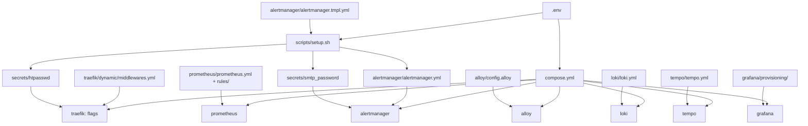

| File | What it controls | What you typically change |
|---|---|---|
| `.env` | Domain, ACME email, passwords, SMTP, retention, versions | Everything specific to your server. Created from `.env.example` |
| `compose.yml` | All services, their networks, volumes, memory limits and Traefik's static configuration | Memory limits, adding a service to the stack |
| `scripts/setup.sh` | Validates `.env`, generates `secrets/htpasswd` and `secrets/smtp_password`, renders `alertmanager.yml` | Nothing. Run it again after changing admin or SMTP settings |
| `traefik/dynamic/middlewares.yml` | Shared middlewares and TLS options | Rate limit values, headers, adding an IP allowlist or SSO middleware |
| `prometheus/prometheus.yml` | Scrape interval, static targets, Docker discovery, Alertmanager address | Adding a target that is not a container (a remote host, for example) |
| `prometheus/rules/*.yml` | Alert rules | Thresholds, new alerts |
| `alertmanager/alertmanager.tmpl.yml` | Grouping, repeat intervals, inhibition, receivers | Adding Slack, Telegram, Teams or a webhook receiver |
| `alloy/config.alloy` | Log collection and parsing, OTLP pipelines | Log parsing rules, sampling, attribute filtering |
| `loki/loki.yml` | Storage, schema, limits, retention | Ingestion limits, moving storage to S3 or MinIO |
| `tempo/tempo.yml` | OTLP receivers, storage, metrics generator | Moving storage to S3 or MinIO |
| `grafana/provisioning/datasources/datasources.yml` | The four datasources and the links between them | Label names if you change them in Alloy |
| `grafana/provisioning/dashboards/dashboards.yml` | Loads JSON dashboards from `grafana/dashboards/` | Nothing |

Files generated by `setup.sh` (`secrets/*`, `alertmanager/alertmanager.yml`) and `.env` are ignored by Git.

---

## 11. Installation

### 11.1 Requirements

| Requirement | Detail |
|---|---|
| Server | Linux with Docker Engine and the Compose plugin v2.20 or later |
| Memory | About 3 GB used at moderate load. Memory limits add up to about 5 GB |
| Disk | 20 GB free for the default retention |
| Network | Ports 80 and 443 open from the Internet. Keep SSH open in your firewall |
| DNS | A or AAAA records to the server for `traefik`, `grafana`, `prometheus` and `alertmanager` under your domain, plus one per application. A wildcard `*.<DOMAIN>` also works |
| SMTP | An account able to send email, for alerts |

### 11.2 Steps

```bash
git clone <this-repo> observability-stack && cd observability-stack

# 1. First run: creates .env from .env.example and stops
./scripts/setup.sh

# 2. Fill in .env: DOMAIN, ACME_EMAIL, passwords, SMTP settings
$EDITOR .env

# 3. Second run: checks .env, generates secrets and alertmanager.yml
./scripts/setup.sh

# 4. Start the stack
docker compose up -d
docker compose ps
```

`setup.sh` refuses to continue while `DOMAIN` is still `example.com` or any password is still `change-me-now`. Values containing `$` must be single-quoted in `.env`, for example `ADMIN_PASSWORD='p$ss'`.

### 11.3 What happens at first start

1. `volume-init` gives Loki and Tempo ownership of their volumes, then exits.
2. `socket-proxy` starts, then Traefik, Prometheus and Alloy connect to it.
3. Traefik discovers the Grafana, Prometheus, Alertmanager and dashboard routes and requests their certificates. This takes a few seconds per domain.
4. Loki and Tempo start. Alloy begins sending logs and waits for OTLP data.
5. Grafana creates its admin account from `GRAFANA_ADMIN_USER` and `GRAFANA_ADMIN_PASSWORD` and provisions the datasources.

### 11.4 First login

| URL | Credentials |
|---|---|
| `https://grafana.<DOMAIN>` | `GRAFANA_ADMIN_USER` / `GRAFANA_ADMIN_PASSWORD` |
| `https://traefik.<DOMAIN>` | `ADMIN_USER` / `ADMIN_PASSWORD` |
| `https://prometheus.<DOMAIN>` | `ADMIN_USER` / `ADMIN_PASSWORD` |
| `https://alertmanager.<DOMAIN>` | `ADMIN_USER` / `ADMIN_PASSWORD` |

Grafana stores its admin password in its database at first start. Changing `GRAFANA_ADMIN_PASSWORD` later has no effect: change it from Grafana's interface instead.

### 11.5 Recommended host setting

Limit the size of Docker log files, since Alloy reads them through the Docker API. In `/etc/docker/daemon.json`:

```json
{ "log-driver": "json-file", "log-opts": { "max-size": "10m", "max-file": "3" } }
```

Then `sudo systemctl restart docker`. This applies to containers created afterwards.

---

## 12. Integrating an application

### 12.1 The four steps

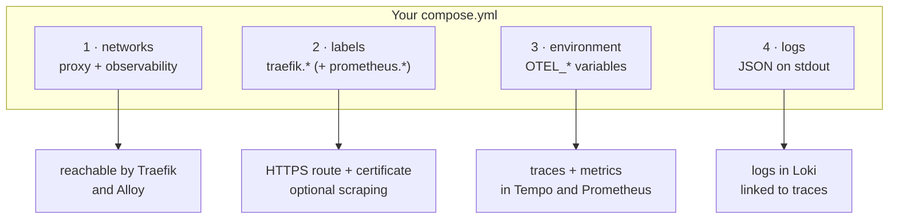

| Step | What you add | What you get |
|---|---|---|
| 1. Networks | `proxy` and `observability` as external networks | Traefik can route to the app. The app can reach Alloy |
| 2. Labels | `traefik.*`, and `prometheus.*` if the app exposes `/metrics` | HTTPS route, certificate, security headers, access logs, request metrics |
| 3. Environment | `OTEL_*` variables and an OpenTelemetry SDK or agent | Traces in Tempo, application metrics, RED metrics, service map |
| 4. Logs | JSON on stdout, with a text level | Searchable logs in Loki, linked to traces |

### 12.2 Complete example

```yaml
services:
  api:
    image: ghcr.io/acme/api:1.4.0
    restart: unless-stopped
    environment:
      OTEL_SERVICE_NAME: api                          # = Compose service name
      OTEL_RESOURCE_ATTRIBUTES: deployment.environment.name=production,service.version=1.4.0
      OTEL_EXPORTER_OTLP_ENDPOINT: http://alloy:4318
      OTEL_EXPORTER_OTLP_PROTOCOL: http/protobuf
      OTEL_TRACES_EXPORTER: otlp
      OTEL_METRICS_EXPORTER: otlp
      OTEL_LOGS_EXPORTER: none                        # logs already go through stdout
    labels:
      traefik.enable: "true"
      traefik.http.routers.api.rule: Host(`api.example.com`)
      traefik.http.routers.api.entrypoints: websecure
      traefik.http.services.api.loadbalancer.server.port: "3000"
      # Only if the app exposes Prometheus metrics:
      # prometheus.scrape: "true"
      # prometheus.port: "3000"
      # prometheus.path: /metrics
    networks: [proxy, observability]

networks:
  proxy:
    external: true
  observability:
    external: true
```

### 12.3 The OpenTelemetry variables

| Variable | Value here | Meaning |
|---|---|---|
| `OTEL_SERVICE_NAME` | `api` | Name shown in Tempo and Grafana. Must equal the Compose service name |
| `OTEL_RESOURCE_ATTRIBUTES` | `deployment.environment.name=production,service.version=1.4.0` | Extra attributes attached to every span and metric |
| `OTEL_EXPORTER_OTLP_ENDPOINT` | `http://alloy:4318` | Where to send data. Use `http://alloy:4317` with gRPC |
| `OTEL_EXPORTER_OTLP_PROTOCOL` | `http/protobuf` | `http/protobuf` for port 4318, `grpc` for port 4317 |
| `OTEL_TRACES_EXPORTER` | `otlp` | Send traces |
| `OTEL_METRICS_EXPORTER` | `otlp` | Send metrics |
| `OTEL_LOGS_EXPORTER` | `none` | Do not also send logs over OTLP, otherwise each line is stored twice |

These variables are part of the OpenTelemetry specification: every language SDK reads them.

### 12.4 Instrumentation per language

| Stack | Zero-code instrumentation | Trace ID in logs |
|---|---|---|
| **Node.js** (Express, NestJS, Fastify, Next.js server) | `npm i @opentelemetry/api @opentelemetry/auto-instrumentations-node`, start with `node --require @opentelemetry/auto-instrumentations-node/register` | Automatic with **pino** or **winston**: fields `trace_id`, `span_id` |
| **Python** (FastAPI, Django, Flask) | `pip install opentelemetry-distro opentelemetry-exporter-otlp`, `opentelemetry-bootstrap -a install`, start with `opentelemetry-instrument python app.py` | `OTEL_PYTHON_LOG_CORRELATION=true` |
| **Java** (Spring Boot) | `-javaagent:opentelemetry-javaagent.jar` | MDC keys `trace_id`, `span_id` (Logback, Log4j) |
| **Go** | SDK plus contrib instrumentations (`otelhttp`, `otelsql`) | Add `trace_id` from `trace.SpanContextFromContext` |
| **PHP** (Laravel, Symfony) | `ext-opentelemetry` plus auto-instrumentation packages, `OTEL_PHP_AUTOLOAD_ENABLED=true` | Monolog processor |
| **.NET** | `OpenTelemetry.AutoInstrumentation` | `ILogger` scopes |

### 12.5 Log format recommendations

| Do | Avoid |
|---|---|
| One JSON object per line on stdout | Multi-line text, logs written to files inside the container |
| A text level: `"level":"error"` | A numeric level: `"level":50` (pino's default) |
| A `trace_id` field (added automatically by OpenTelemetry for pino, winston, Logback, Python logging) | Building the trace ID by hand |
| Stable field names across services | Secrets, tokens, full card numbers or passwords in logs |

### 12.6 Working example

`examples/node-app/` contains an Express service (`server.js`, `Dockerfile`, `compose.yml`, `package.json`) tested against this stack. A request to `/users` produces:

- a trace `GET /users` → `request handler` → `db.fetch-users` in Tempo;
- a JSON log line `users served` carrying the same `trace_id` in Loki;
- HTTP server metrics in Prometheus.

```bash
cd examples/node-app
sed -i 's/api.example.com/api.<DOMAIN>/' compose.yml
docker compose up -d --build
curl https://api.<DOMAIN>/users
```

### 12.7 Developer checklist

- [ ] Container on the `proxy` and `observability` networks
- [ ] `traefik.enable=true`, a unique router name, `Host()` rule, `websecure` entrypoint, service port
- [ ] DNS record for the domain
- [ ] `OTEL_SERVICE_NAME` equal to the Compose service name
- [ ] OpenTelemetry SDK or agent loaded at start-up
- [ ] JSON logs on stdout with a text level
- [ ] If exposing `/metrics`: `prometheus.scrape` and `prometheus.port` labels

---

## 13. Verification checklist

| Check | How | Expected |
|---|---|---|
| Containers | `docker compose ps` | All `running`, Traefik, Prometheus and Alertmanager `healthy`, `volume-init` exited with code 0 |
| TLS | `curl -I https://grafana.<DOMAIN>` | `200` or `302`, valid certificate, `strict-transport-security` header |
| HTTP redirect | `curl -I http://grafana.<DOMAIN>` | `301` to HTTPS |
| Admin auth | `curl -I https://prometheus.<DOMAIN>` | `401` without credentials |
| Scrape targets | Prometheus → *Status → Targets* | All `UP` |
| Alert rules | Prometheus → *Alerts* | 15 rules loaded |
| Alertmanager link | Prometheus → *Status → Runtime & Build Information* | One Alertmanager discovered |
| Logs | Grafana → *Explore* → Loki → `{service_name="traefik"}` | Traefik access logs |
| Traces | Grafana → *Explore* → Tempo → *Search* | `traefik` spans after a request |
| Service graph | Tempo → *Service Graph* | Nodes after a few minutes of traffic between services |
| Correlation | A Loki line with `trace_id` → *View trace* | The trace opens in Tempo |
| Email | `docker compose exec alertmanager amtool alert add test severity=warning --alertmanager.url=http://localhost:9093` | Email received within about 30 seconds |

---

## 14. Operations

### 14.1 Everyday commands

```bash
docker compose ps                              # status
docker compose logs -f traefik                 # follow one service
docker compose restart alloy                   # restart one service
docker compose up -d                           # apply compose.yml or .env changes
docker compose pull && docker compose up -d    # after changing versions in .env
```

### 14.2 Sizing (single host, moderate traffic)

| Service | Memory limit | Disk |
|---|---|---|
| Traefik | 256 MB | < 1 MB (`acme.json`) |
| Prometheus | 1 GB | Up to `PROMETHEUS_RETENTION_SIZE` (10 GB) |
| Loki | 1 GB | About 1–5 GB for 14 days, depending on log volume |
| Tempo | 1 GB | About 1–10 GB for 7 days, depending on traffic |
| Alloy | 512 MB | Small (read positions, buffers) |
| Grafana | 512 MB | < 500 MB |
| cAdvisor, node-exporter, Alertmanager | 256 MB, 64 MB, 128 MB | Negligible |

### 14.3 Retention

| Signal | Variable | Default | Enforced by |
|---|---|---|---|
| Metrics | `PROMETHEUS_RETENTION_TIME` / `PROMETHEUS_RETENTION_SIZE` | 15 days / 10 GB, whichever comes first | Prometheus TSDB |
| Logs | `LOKI_RETENTION` | 336h (14 days) | Loki compactor |
| Traces | `TEMPO_RETENTION` | 168h (7 days) | Tempo compaction |

Change the value in `.env`, then `docker compose up -d`.

### 14.4 Backups

| Volume | Priority | Contains |
|---|---|---|
| `observability_grafana_data` | High | Users, dashboards edited in the UI, annotations, preferences |
| `observability_letsencrypt` | Medium | Certificates. Avoids re-issuing them and hitting Let's Encrypt rate limits |
| `observability_alertmanager_data` | Low | Active silences |
| `observability_prometheus_data` | Low | Metrics history |
| `observability_loki_data`, `observability_tempo_data` | Low | Short-lived by design |

Configuration is in Git. Keep a separate, secure copy of `.env` and `secrets/`.

```bash
# Back up Grafana (stop it for a consistent SQLite copy)
docker compose stop grafana
docker run --rm -v observability_grafana_data:/data -v "$PWD":/backup busybox \
  tar czf /backup/grafana-$(date +%F).tgz -C /data .
docker compose start grafana

# Restore
docker compose stop grafana
docker run --rm -v observability_grafana_data:/data -v "$PWD":/backup busybox \
  sh -c 'rm -rf /data/* && tar xzf /backup/grafana-2026-09-17.tgz -C /data'
docker compose start grafana
```

### 14.5 Upgrades

1. Read the release notes of the component. Pay attention to Loki schema changes, Tempo major versions and Traefik minor versions.
2. Change the version in `.env`.
3. Apply to that service only:

```bash
docker compose pull <service> && docker compose up -d <service>
```

Pinned versions make upgrades deliberate. A tool such as Renovate can open a pull request when a new version is released.

### 14.6 Reloading without restarting

| Component | How |
|---|---|
| Traefik middlewares | Automatic when `traefik/dynamic/middlewares.yml` changes |
| Traefik routes | Automatic when containers start or stop |
| Prometheus configuration and rules | `docker compose exec prometheus wget -qO- --post-data='' http://localhost:9090/-/reload` |
| Grafana dashboards | Automatic within 30 s for files in `grafana/dashboards/` |
| Alertmanager, Alloy, Loki, Tempo | `docker compose restart <service>` |

### 14.7 When one host is no longer enough

| Pressure | Next step |
|---|---|
| Log or trace volume fills the disk | Move Loki and Tempo storage to S3-compatible object storage (MinIO, AWS S3, Backblaze B2) |
| Several servers to monitor | Run node-exporter, cAdvisor and Alloy on each host and send to this central stack through authenticated Traefik routes |
| Long-term metrics | Add `remote_write` from Prometheus to Grafana Mimir or Thanos |
| High availability | Move to Kubernetes with the official Helm charts. Application instrumentation stays the same |

---

## 15. Security hardening

The default setup is secure for a single server. For stricter environments:

| Measure | How |
|---|---|
| Restrict admin UIs by IP | Add an `ipAllowList` middleware in `middlewares.yml` with `sourceRange: ["203.0.113.0/24"]` and chain it before `admin-auth@file` |
| Single sign-on | Replace `admin-auth` with a `forwardAuth` middleware pointing to Authelia, authentik or oauth2-proxy |
| SSO for Grafana | Configure Grafana's generic OAuth with the `GF_AUTH_GENERIC_OAUTH_*` variables |
| Test certificates first | Add `--certificatesresolvers.letsencrypt.acme.caserver=https://acme-staging-v02.api.letsencrypt.org/directory` to avoid production rate limits while testing, then remove it and delete `acme.json` |
| Firewall | Allow only 22, 80 and 443 inbound. Only 80 and 443 are published by Docker here, so Docker's own iptables rules do not open anything else |
| Rotate secrets | Change the value in `.env`, run `./scripts/setup.sh`, then `docker compose up -d` |
| Sensitive data in telemetry | Remove attributes in Alloy (`otelcol.processor.attributes`) or drop log lines (`stage.drop`) before they are stored |

---

## 16. Troubleshooting

### Reverse proxy

| Symptom | Likely cause | Fix |
|---|---|---|
| `404 page not found` | Missing `traefik.enable=true`, wrong `Host` rule, or the container is not on `proxy` | Check labels and networks. `docker compose logs traefik \| grep -i error` |
| *TRAEFIK DEFAULT CERT* in the browser | ACME challenge failed | The domain must resolve to the server and port 80 must be reachable. `docker compose logs traefik \| grep -i acme` |
| `too many certificates already issued` | Let's Encrypt rate limit | Wait, and use the staging server while testing (section 15) |
| `502 Bad Gateway` | Wrong `loadbalancer.server.port`, or the app listens on `127.0.0.1` | Use the internal port. Make the app listen on `0.0.0.0` |
| `401` on Grafana | `admin-auth` added to the Grafana router | Grafana has its own login. Remove the middleware |

### Monitoring

| Symptom | Likely cause | Fix |
|---|---|---|
| Application missing from targets | Not on `observability`, or `prometheus.scrape`/`prometheus.port` missing | Add them, wait 30 s |
| Target `DOWN` | Wrong port or path, or the app does not expose metrics | Check `prometheus.port` and `prometheus.path` |
| No alert emails | SMTP settings or password | Look for `AlertmanagerNotificationsFailing`. `docker compose logs alertmanager` |
| Rules missing after an edit | Syntax error, reload failed | `promtool check rules` (section 6.4), then reload |

### Logs

| Symptom | Likely cause | Fix |
|---|---|---|
| No logs for a container | Label `logging=false`, or nothing written to stdout/stderr | Log to stdout. `docker compose logs alloy` |
| `level` label empty | Logs are not JSON, or the level is numeric | Emit JSON with a text level (see `examples/node-app/server.js`) |
| `entry too far behind` in Alloy's logs | Old lines replayed after a long outage | Expected: lines older than 7 days are rejected |
| Query too slow | Query without a precise label selector | Always start with `{service_name="…"}` |

### Tracing

| Symptom | Likely cause | Fix |
|---|---|---|
| No traces from an application | Wrong endpoint, port or protocol | HTTP: `http://alloy:4318` with `http/protobuf`. gRPC: `http://alloy:4317` with `grpc`. The app must be on `observability` |
| Traefik spans and app spans in separate traces | The framework is not instrumented, so `traceparent` is ignored | Load the OpenTelemetry agent or auto-instrumentation at start-up |
| Trace to logs link returns nothing | `OTEL_SERVICE_NAME` differs from the Compose service name | Align both names |
| Service graph empty | Not enough traffic, or only one instrumented service | The graph needs calls between at least two instrumented services |
| No RED metrics | Tempo cannot write to Prometheus | `docker compose logs tempo \| grep -i remote` |

### Accessing Alloy's UI for debugging

Alloy's UI shows every component and its health, but it is not exposed. To open it temporarily, add these labels to the `alloy` service, add the `proxy` network to it, and run `docker compose up -d alloy`. Remove them afterwards.

```yaml
labels:
  traefik.enable: "true"
  traefik.http.routers.alloy.rule: Host(`alloy.${DOMAIN}`)
  traefik.http.routers.alloy.entrypoints: websecure
  traefik.http.routers.alloy.middlewares: admin-auth@file
  traefik.http.services.alloy.loadbalancer.server.port: "12345"
```

---

## 17. Reference

### 17.1 Environment variables (`.env`)

| Variable | Default | Used by | Description |
|---|---|---|---|
| `DOMAIN` | `example.com` | Traefik labels, Prometheus, Alertmanager, Grafana | Base domain. UIs are served on its subdomains |
| `ACME_EMAIL` | `admin@example.com` | Traefik | Let's Encrypt account email: expiry warnings |
| `ADMIN_USER` / `ADMIN_PASSWORD` | `admin` / `change-me-now` | `setup.sh` → `secrets/htpasswd` | Basic auth for Traefik dashboard, Prometheus, Alertmanager |
| `GRAFANA_ADMIN_USER` / `GRAFANA_ADMIN_PASSWORD` | `admin` / `change-me-now` | Grafana | Initial admin account, first start only |
| `ALERT_EMAIL_TO` | `ops@example.com` | `setup.sh` → Alertmanager | Recipients, comma-separated |
| `SMTP_HOST` | `smtp.example.com:587` | Alertmanager | SMTP server and port, TLS required |
| `SMTP_FROM` / `SMTP_USER` | `alerts@example.com` | Alertmanager | Sender address and SMTP login |
| `SMTP_PASSWORD` | `change-me-now` | `setup.sh` → `secrets/smtp_password` | SMTP password |
| `PROMETHEUS_RETENTION_TIME` | `15d` | Prometheus | Maximum age of metrics |
| `PROMETHEUS_RETENTION_SIZE` | `10GB` | Prometheus | Maximum disk size of metrics |
| `LOKI_RETENTION` | `336h` | Loki | Log retention |
| `TEMPO_RETENTION` | `168h` | Tempo | Trace retention |
| `*_VERSION` | see `.env.example` | All images | Pinned image versions |

### 17.2 Docker labels understood by the stack

| Label | Read by | Required | Example |
|---|---|---|---|
| `traefik.enable` | Traefik | Yes, to be routed | `"true"` |
| `traefik.http.routers.<name>.rule` | Traefik | Yes | ``Host(`api.example.com`)`` |
| `traefik.http.routers.<name>.entrypoints` | Traefik | Recommended | `websecure` |
| `traefik.http.services.<name>.loadbalancer.server.port` | Traefik | If the image exposes several ports or none | `"3000"` |
| `traefik.http.routers.<name>.middlewares` | Traefik | No | `compress@file,rate-limit@file` |
| `prometheus.scrape` | Prometheus | Yes, to be scraped | `"true"` |
| `prometheus.port` | Prometheus | Yes, with `prometheus.scrape` | `"3000"` |
| `prometheus.path` | Prometheus | No, default `/metrics` | `/internal/metrics` |
| `logging` | Alloy | No | `"false"` to skip log collection |

### 17.3 Ports

| Port | Service | Published on host | Protocol |
|---|---|---|---|
| 80 | Traefik `web` | Yes | HTTP, ACME challenge, redirect |
| 443 | Traefik `websecure` | Yes | HTTPS |
| 8081 | Traefik `ping` | No | Healthcheck |
| 8082 | Traefik `metrics` | No | Prometheus metrics |
| 2375 | socket-proxy | No | Filtered Docker API |
| 9090 | Prometheus | No | UI, API, remote write |
| 9093 | Alertmanager | No | UI, API |
| 9100 | node-exporter | No | Metrics |
| 8080 | cAdvisor | No | Metrics |
| 4317 / 4318 | Alloy | No | OTLP gRPC / HTTP |
| 12345 | Alloy | No | UI, metrics |
| 3100 | Loki | No | Push, query, OTLP logs |
| 3200 | Tempo | No | Query API, metrics |
| 4317 | Tempo | No | OTLP gRPC from Alloy |
| 3000 | Grafana | No | UI |

### 17.4 Volumes

| Volume | Mounted in | Content |
|---|---|---|
| `letsencrypt` | Traefik `/letsencrypt` | `acme.json`: certificates and ACME account |
| `prometheus_data` | Prometheus `/prometheus` | Metrics database |
| `alertmanager_data` | Alertmanager `/alertmanager` | Silences, notification log |
| `grafana_data` | Grafana `/var/lib/grafana` | SQLite database, plugins |
| `alloy_data` | Alloy `/var/lib/alloy/data` | Log read positions |
| `loki_data` | Loki `/loki` | Index, chunks, compactor state |
| `tempo_data` | Tempo `/var/tempo` | WAL, trace blocks, generator WAL |

Volumes are prefixed with the project name on the host: `observability_grafana_data`, and so on.

### 17.5 Repository layout

```
observability-stack/
├── compose.yml                          # the whole stack
├── .env.example                         # domain, credentials, retention, pinned versions
├── scripts/
│   └── setup.sh                         # validates .env, generates secrets, renders Alertmanager config
├── traefik/
│   └── dynamic/middlewares.yml          # security headers, auth, compression, rate limit, TLS options
├── prometheus/
│   ├── prometheus.yml                   # static targets + Docker label discovery
│   └── rules/                           # host, containers, traefik, stack alerts
├── alertmanager/
│   └── alertmanager.tmpl.yml            # routing, inhibition, email receiver
├── alloy/
│   └── config.alloy                     # Docker logs + OTLP traces/metrics/logs pipelines
├── loki/
│   └── loki.yml                         # single binary, TSDB v13, retention, structured metadata
├── tempo/
│   └── tempo.yml                        # monolithic Tempo 3, OTLP, metrics generator
├── grafana/
│   ├── provisioning/datasources/        # Prometheus, Loki, Tempo, Alertmanager + correlations
│   ├── provisioning/dashboards/         # file provider
│   └── dashboards/                      # your dashboard JSON files
├── secrets/                             # generated by setup.sh, ignored by Git
└── examples/
    └── node-app/                        # tested integration example: Express + pino + OpenTelemetry
```

---

## 18. Design decisions

| Decision | Instead of | Reason |
|---|---|---|
| **Loki** for logs | Elasticsearch + Kibana | Indexes labels only, not full text. It needs a fraction of the memory (no 2 GB JVM heap) and shares Grafana with metrics and traces |
| **Tempo** for traces | Jaeger all-in-one | Stores traces on plain local or object storage, generates RED metrics and a service graph, and links natively to Loki and Prometheus |
| **Grafana Alloy** as the only agent | Promtail + OpenTelemetry Collector | Promtail reached end of life in March 2026. Alloy covers Docker logs and the OTLP pipelines in one process and one configuration |
| **OTLP** as the application protocol | Vendor SDKs, Jaeger or Zipkin clients | Vendor-neutral standard: applications do not change if the backend changes |
| **Structured metadata** for `trace_id` | Indexed label | Keeps Loki's index small while still allowing search and linking |
| **Docker socket proxy** | Mounting `docker.sock` in Traefik, Prometheus and Alloy | A compromised component can read container metadata but cannot take control of the host |
| **Traefik static configuration as flags** | `traefik.yml` + flags | Traefik accepts only one static source. Flags read `${VAR}` from `.env` and avoid a silently ignored file |
| **Label-based discovery** | Editing `prometheus.yml` for each application | Adding an application never touches the observability stack |
| **Only 80 and 443 published** | Publishing each UI port | Every access goes through TLS and authentication |
| **Tempo metrics generator** | Hand-written latency metrics | RED metrics for every instrumented service at no code cost |
| **Pinned image versions** | `latest` tags | Reproducible deployments, deliberate upgrades |
| **Memory limits on every service** | Unlimited containers | One runaway component cannot take down the host |

---

## 19. Glossary

| Term | Definition |
|---|---|
| **ACME** | Protocol used by Let's Encrypt to prove domain ownership and issue certificates |
| **Cardinality** | Number of distinct label combinations. High cardinality makes metric and log databases slow and expensive |
| **Compactor** | Background process of Loki and Tempo that merges data and deletes what is past retention |
| **Entrypoint** | Port on which Traefik listens |
| **Exemplar** | A metric sample that carries a trace ID, linking a point on a graph to a real request |
| **Inhibition** | Alertmanager rule that silences some alerts while a related, more severe alert fires |
| **LogQL** | Loki's query language |
| **Middleware** | Traefik component that modifies a request or response: headers, auth, compression |
| **OTLP** | OpenTelemetry Protocol, used to send traces, metrics and logs |
| **PromQL** | Prometheus query language |
| **RED** | Rate, Errors, Duration: the three key metrics of a request-driven service |
| **Remote write** | Protocol for pushing metrics into Prometheus instead of scraping them |
| **Router** | Traefik rule matching requests to a service |
| **Scrape** | Prometheus pulling metrics from an HTTP endpoint |
| **Service graph** | Map of calls between services, derived from traces |
| **Span** | One timed operation inside a trace: an HTTP request, a database query |
| **Structured metadata** | Loki key-value data attached to a log line, searchable but not indexed |
| **Trace** | The full tree of spans produced by one request |
| **traceparent** | W3C HTTP header carrying the trace context between services |
| **TraceQL** | Tempo's query language |
| **WAL** | Write-ahead log: data written to disk before processing, so nothing is lost on a crash |
